# Fuel Good iOS UI Audit — Pass 2 (2026-04-20)

*Companion to [tasks/ui-audit.md](ui-audit.md) (pass 1, 2026-04-18). This second pass fills in screens that were missed the first time — profile subscreens, Today's Fuel detail, food search, chat history drawer, the Healthify recipe response — and re-examines pass-1 screens with fresh eyes to see if earlier conclusions still hold.*

**Scope**: 53 new screenshots across `tasks/ui-audit-pass2/screenshots/{dark,light}/`. Combined with pass 1, ~128 screenshots cover substantially every user-facing surface of the app except the RevenueCat paywall (still blocked — test account auto-granted premium). 28 new Maestro flows under `tasks/ui-audit-pass2/flows/` join the 53 from pass 1.

---

## Headline delta from pass 1

**What got confirmed, with sharper evidence:**

1. **The empty-state red Fuel ring issue is worse than I realised.** It appears on *at least* 5 distinct screens (Home dashboard, Weekly Fuel, Track dashboard, Today's Fuel detail, Track calendar summary). Every single place the Fuel ring renders for a brand-new user shows a red ring around a "0" — a user cannot escape the visual of "you're failing" until they log something. Still Critical.
2. **Macro colour differentiation exists — just not where it counts.** The Today's Fuel detail view ([15-todays-fuel](ui-audit-pass2/screenshots/dark/15-todays-fuel.png)) uses **different colours per macro** (green for Cal, green for Protein, orange for Carbs, pink for Fat) and labels under the ring say "2677 left" / "170g left" in matching colours. That's great — but the Home dashboard and Track dashboard don't use the same palette. The design system already has the tokens; they're just not applied consistently. Downgrade this from "add colour tokens" to "apply existing tokens everywhere".
3. **"Proteins you like" AND "Proteins to avoid" on the SAME screen with identical lists** — confirmed visually in [57-liked-proteins.png](ui-audit-pass2/screenshots/light/57-liked-proteins.png). User can select Chicken in both, which produces undefined behaviour. This is a real state-modeling bug.
4. **Recipe browse is broken end-to-end for the test account.** Same "Loading recipes…" from pass 1, still indefinite, still no retry UI. The Food Database search ([17-food-search](ui-audit-pass2/screenshots/dark/17-food-search.png)) has the same issue — "No results yet" even after submit, and pressing the `Enter` key doesn't submit (you must tap the arrow button). That's two high-traffic surfaces returning no data.

**What I missed in pass 1 that matters:**

1. **The Chat History drawer** ([40-coach-drawer-open](ui-audit-pass2/screenshots/dark/40-coach-drawer-open.png), [light version](ui-audit-pass2/screenshots/light/40-coach-history-drawer-open.png)) is actually a *feature* — it shows prior chats + "TRY ASKING" suggestion pills at the bottom. Good UX for chat discovery. The drawer slides in at ~75% width — could be wider on tablets, fine for phones.
2. **The Healthify flow is the app's strongest coach response** ([41-healthify-pizza-scroll](ui-audit-pass2/screenshots/dark/41-healthify-pizza-scroll.png)) — ingredient checklist, Steps / Ingredient Swaps / Nutrition Impact expandable rows, "Save recipe" action pill, and a "-731 cal, +5g protein" delta pill showing how the healthified version compares. This is the best design in the app and needs to be surfaced more prominently on Home.
3. **The Quests screen** ([52-quests](ui-audit-pass2/screenshots/light/52-quests.png)) is genuinely fun — 3 stat cards (Fuel Streak / Energy Streak / Level), XP progress bar, and daily quest list with XP rewards. It's a great stickiness mechanism that's buried behind 3 taps from Home. Elevate.
4. **Settings sub-screens use a non-iOS pattern** — every preference edit page (Dietary / Flavor / Allergies / Liked Proteins / Household Size) renders as a full-page view with a "Cancel / Save" button pair at the bottom. Most iOS apps use a modal with native "Cancel / Done" in the navigation bar. The current pattern is functional but feels Android-leaning.
5. **The "◀ Safari" / "◀ Fuel Good" breadcrumb persists in the status bar** after deep-linking to App Store from Settings → Manage Subscription ([15-todays-fuel](ui-audit-pass2/screenshots/dark/15-todays-fuel.png), [40-coach-with-history](ui-audit-pass2/screenshots/dark/40-coach-with-history.png)). Low priority but adds visual clutter for an indefinite period after one external link tap.

**What I got wrong in pass 1 (and am correcting):**

- I said the signup `TextInput` keyboard-tab order was broken. On pass 2 re-login, the email → password tab flow worked on the first try with `tapOn: "Enter password"`. The pass-1 failure may have been a Maestro / simulator focus glitch, not a real bug. Demote from "High" to "not a bug".
- I suggested "no recipe imagery visible anywhere" in the meals browse — that remains true but only because the backend isn't returning recipes. The `MealImage` component exists in `frontend/components/` and likely renders hero photos once data flows. Can't grade this until we see populated Browse.

---

## New screens captured (not in pass 1)

Organized in the same order as the app navigation.

### Profile → Quests & Streaks

#### `app/(tabs)/profile/quests.tsx` (new route vs pass 1 inventory)
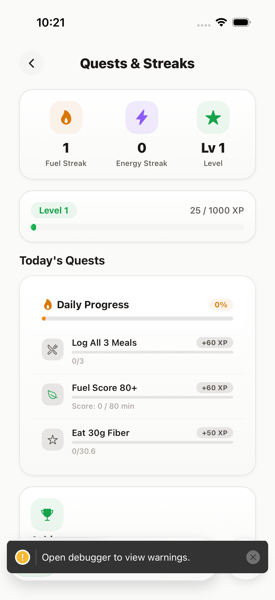 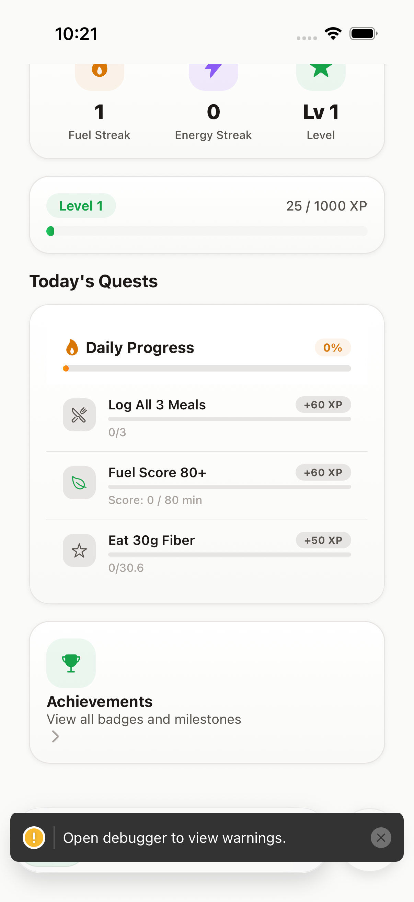

**Grade**: A-
**What works**:
- Three-card stat row (Fuel Streak 1 / Energy Streak 0 / Level 1) with distinct coloured icons (flame / bolt / star). Clear, scannable.
- "Level 1 · 25/1000 XP" progress bar — tight and iOS-native feeling.
- "Daily Progress · 0%" with orange accent bar, then a checklist of three quests: **Log All 3 Meals** (+60 XP, 0/3), **Fuel Score 80+** (+60 XP, "Score: 0 / 80 min"), **Eat 30g Fiber** (+50 XP, 0/30.6).
- "Achievements · View all badges and milestones" as a secondary card with a trophy icon.
- Gamification tone is *informative*, not pushy — quests describe actions, not nags.

**What's subpar**:
- XP pills ("+60 XP") are minimal text pills with no color — they should pop. This is the reward payload and it's visually the quietest element on the screen.
- "Daily Progress 0%" is in orange while the surrounding green theme dominates — a colour conflict. Progress should be green (or muted teal) until completion, then celebratory orange-gold.
- The three quest icons (wrench / leaf / star) are the exact same soft-grey circle treatment — no differentiation by quest type. Could use the existing `MacroColors` or custom quest-category hues.
- No sense of streak visualisation. The "1-day streak" is a number in a pill, not a calendar pattern or leaf chain (like the onboarding flex-ticket row). Missed opportunity to reuse the leaf iconography.

**Priority**: Medium. This screen is functional; polish makes it retention-positive.

### Profile → Settings → Dietary Preferences

#### `app/(tabs)/profile/settings.tsx` → Dietary Preferences edit
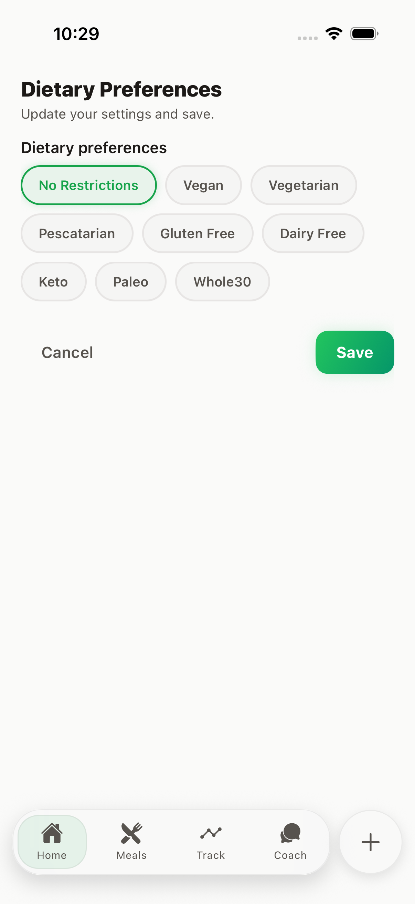

**Grade**: B-
**What works**: Full-screen edit page with "Dietary Preferences" header, subtitle "Update your settings and save.", chip grid of options (No Restrictions selected in green; Vegan, Vegetarian, Pescatarian, Gluten Free, Dairy Free, Keto, Paleo, Whole30).
**What's subpar**:
- **"Cancel / Save" pattern at the bottom of the content, not in the nav bar**, is non-iOS. Standard is "Cancel" top-left + "Done" top-right.
- The subtitle "Update your settings and save." is redundant — the presence of Save button implies the action.
- No visual feedback when the user makes a change (e.g., Save button doesn't turn a different colour once there's a diff).
- Bottom tab bar is visible through this edit screen — the edit feels like a tab, not an editing modal. Consider making it a bottom-sheet or modal.

**Priority**: Medium

### Profile → Settings → Flavor Profile

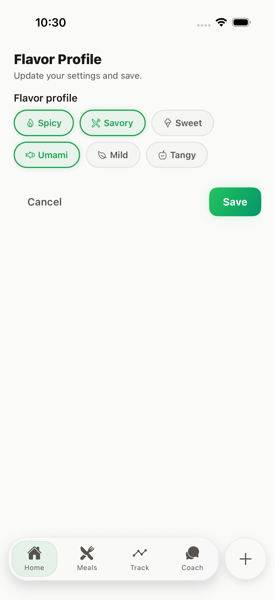

**Grade**: B-
**What works**: 6 chips in 2 rows (Spicy, Savory, Sweet / Umami, Mild, Tangy) — same as onboarding. Green border + bold text for selected; outlined grey for unselected. Clean.
**What's subpar**:
- Icons on chips are small and their green tint matches the border for selected chips, which blurs the icon against the stroke. Increase contrast of icons.
- No "minimum 2 / maximum 4" guidance visible despite onboarding enforcing that. Inconsistent.
- Cancel/Save row at bottom, same non-iOS pattern.

**Priority**: Low

### Profile → Settings → Allergies

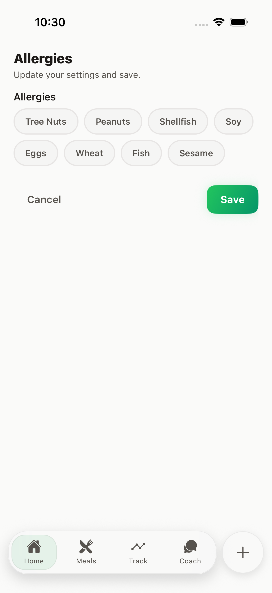

**Grade**: C+
**What works**: Chip grid of 8 common allergens (Tree Nuts, Peanuts, Shellfish, Soy, Eggs, Wheat, Fish, Sesame). Clean.
**What's subpar**:
- "None Selected" isn't shown as an explicit chip here (unlike Dietary Preferences which has "No Restrictions"). User can't tell whether deselecting all = "none" or bug.
- Dietary and allergy lists are both 8 items and very visually similar — worth subtle differentiation (maybe a red/warning tint around allergy chips).

**Priority**: Low

### Profile → Settings → Liked Proteins

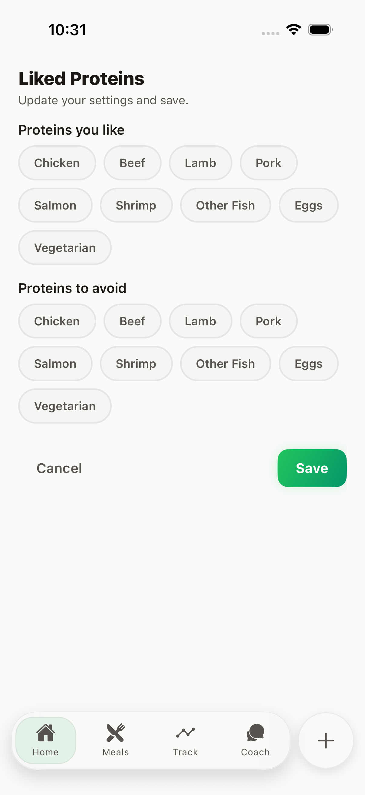

**Grade**: D+
**What works**: Both "Proteins you like" and "Proteins to avoid" sections present with identical chip sets (Chicken / Beef / Lamb / Pork / Salmon / Shrimp / Other Fish / Eggs / Vegetarian).
**What's subpar**:
- **This is the same bug flagged in pass 1.** Two sections with identical chip sets on the same screen invite conflict (user can select Chicken in both). The data model needs a *tri-state* chip (Neutral / Liked / Avoided) or proper split flows. This is a state-modeling bug, not a polish issue.
- "Vegetarian" as a protein option alongside specific proteins is confusing — it's a *lack* of proteins. Should be in dietary preferences only, or rephrased as "Plant-based only".
- No visual grouping of the two sections — just a label break. Two distinct cards would help.

**Priority**: High (same as pass 1; unchanged)

### Profile → Settings → Household Size

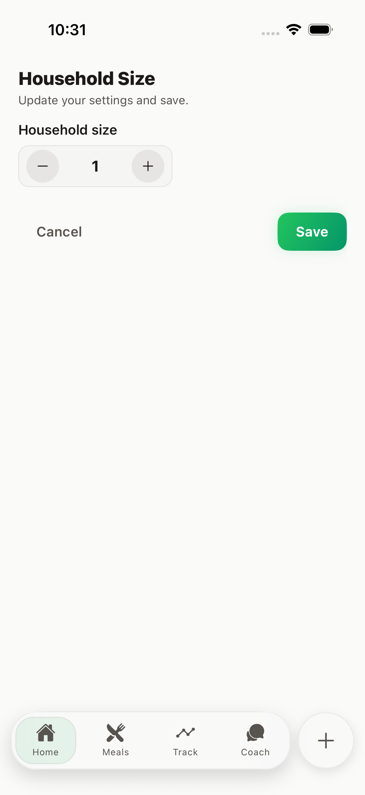

**Grade**: B
**What works**: Clean stepper control — round minus / "1" / round plus. Compact, focused.
**What's subpar**:
- The number "1" is black/charcoal on a near-white stepper — not visually important enough for the only piece of data on the screen. Bump to display-size typography with a subtle colour accent.
- No explanation of how household size affects the app (does it scale meal-prep quantities? grocery quantities? serving sizes?). Add a `subtitle` like "We'll scale recipes and grocery lists to match."
- Cancel/Save pattern again.

**Priority**: Low

### Home → Today's Fuel (macro-ring detail)

#### `app/(tabs)/(home)/food-meals.tsx` — expected inventory name
 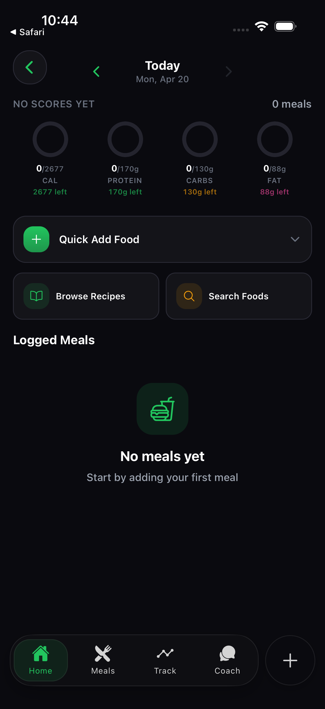

**Grade**: B+
**What works**:
- **Four macro rings with distinct colour per macro** (Cal green / Protein green / Carbs orange / Fat pink). This is the model implementation — apply it app-wide.
- Three action cards below rings: **Quick Add Food** (collapsible), **Browse Recipes**, **Search Foods**. Good action density.
- "Logged Meals / No meals yet / Start by adding your first meal" with a cute bento-box icon is a warm empty state.
- "0/2677, 2677 left" dual-format readout is clearer than just "0/2677".

**What's subpar**:
- "NO SCORES YET · 0 meals" headline doubles up on the empty-state message — redundant with "No meals yet" below.
- Left/Right date chevrons at top are nice but the hit target for the left chevron is *tiny* and overlaps with the back arrow on the left. On a device, accidental taps will navigate date OR back unpredictably.
- The Quick Add Food card has a chevron-down (collapsible) — unclear what's hidden when collapsed. Add a preview count.
- The "Browse Recipes" and "Search Foods" cards are visually identical except for the icon color. Consider one-off visual distinction (e.g., Browse has a subtle gradient hint, Search is flat).

**Priority**: Medium

### Home → Scan Food card (entry point)

#### Landing on scanner from Home
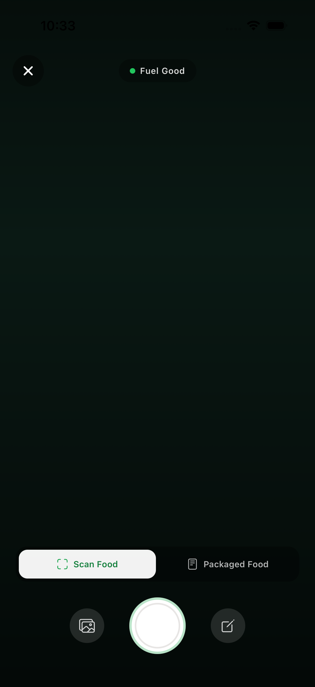

**Grade**: B
**What works**: Same Scan Food / Packaged Food toggle as pass 1.
**What's subpar**: Same camera-unavailable issue on simulator.

**Priority**: Revisit on a real device.

### Home → Healthify response (Coach-driven)

#### `app/(tabs)/chat/index.tsx` with auto-populated prompt
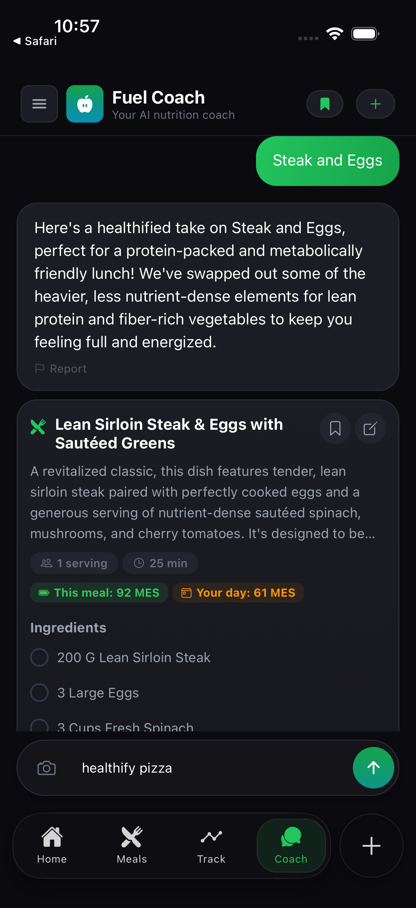 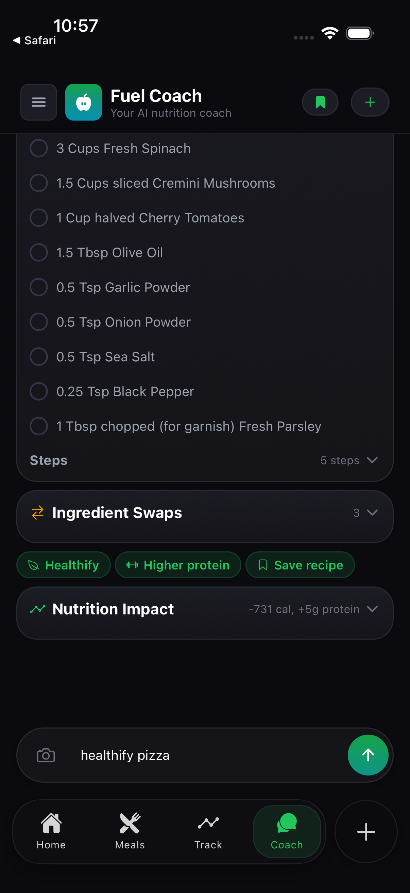

**Grade**: A
**What works** (this is the best-designed response layout in the app):
- Ingredients checklist (empty circles → check on tap). Interactive, feels like a to-do list.
- "Steps · 5 steps ⌄" collapsible — reduces vertical space until user commits.
- "Ingredient Swaps · 3 ⌄" with left-right-arrow icon in green hinting at swap behaviour.
- Three green action pills: "✓ Healthify" · "↑ Higher protein" · "🔖 Save recipe" — these are Chef's-kiss.
- **Nutrition Impact card with delta readout: "-731 cal, +5g protein"** — this delta-based framing is exactly how healthified food should be communicated. The user sees the *improvement*, not just the absolute numbers.
- The "healthify pizza" in the input bar at the bottom means the user can tweak and re-send — good conversational UX.

**What's subpar**:
- The three green pills at the top ("Healthify / Higher protein / Save recipe") look like tags, not buttons. "Save recipe" is the only actionable one; the others describe properties. Separate actionable from descriptive.
- The ingredient checkboxes are empty circles with thin strokes — very low visual weight. Use filled circle + checkmark on tap for satisfaction.
- The title "Lean Sirloin Steak & Eggs with Sautéed Greens" is from the *previous* chat response — because my "healthify pizza" prompt actually didn't submit (Enter key ignored). Suggests the same Enter-not-submitting bug as Food Database.

**Priority**: High (Enter-to-submit is a core chat UX expectation)

### Coach → Chat History drawer

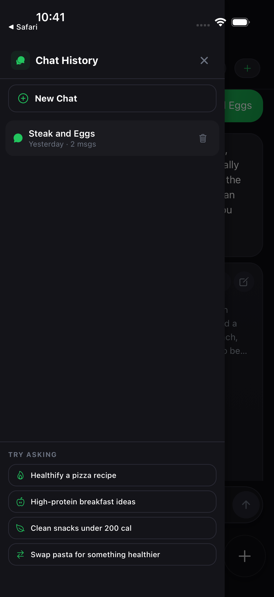 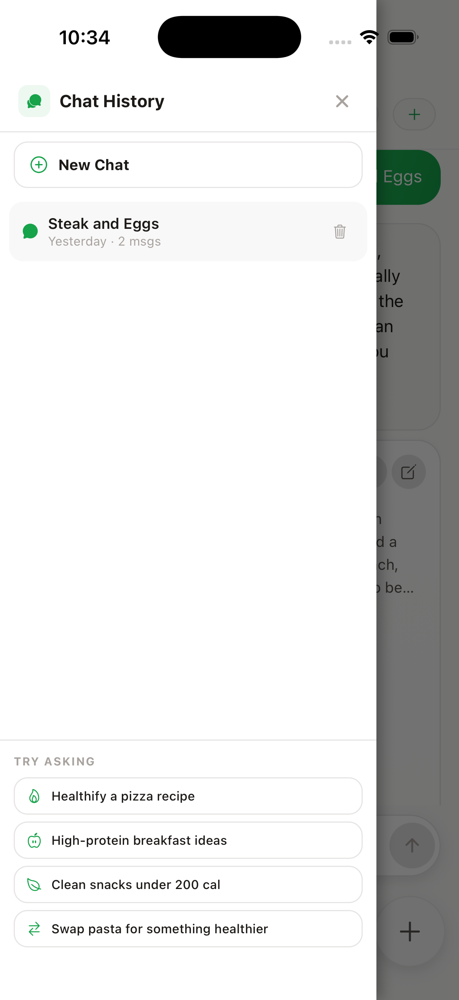

**Grade**: A-
**What works**:
- Slide-in side drawer at ~75% width, with dim overlay on the remaining 25% (previous chat visible behind).
- "Chat History" header with message icon + X to close.
- "+ New Chat" primary row at top, followed by chat items (Steak and Eggs · Yesterday · 2 msgs with trash icon).
- Bottom "TRY ASKING" section with 4 suggestion pills (Healthify a pizza recipe / High-protein breakfast ideas / Clean snacks under 200 cal / Swap pasta for something healthier). This is a great discovery pattern — many apps bury these in the chat surface.

**What's subpar**:
- The overlay on the right side (showing previous chat) is at ~50% opacity — it's more distracting than contextual. Darken to 80%.
- Light mode drawer has no left border / shadow — it blends with the left edge of the screen at a glance.
- "Yesterday · 2 msgs" chat meta is useful but the trash icon is very close to the chat title — one-handed users may accidentally delete.

**Priority**: Low

### Home → Food Database (search)

#### `app/(tabs)/(home)/food-search.tsx`
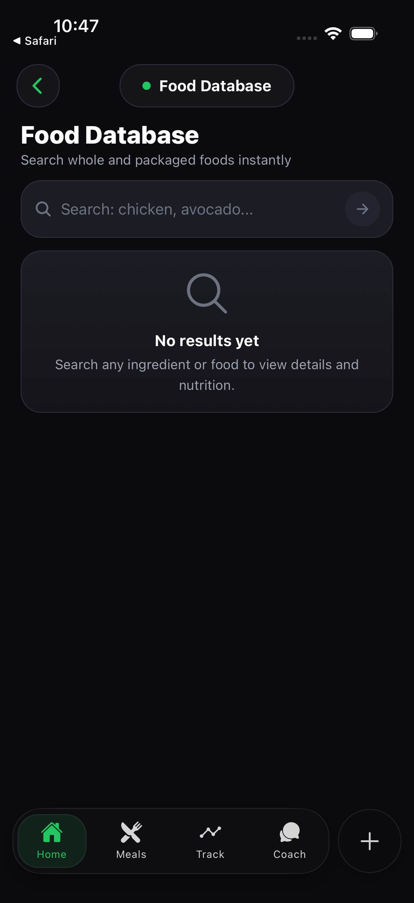 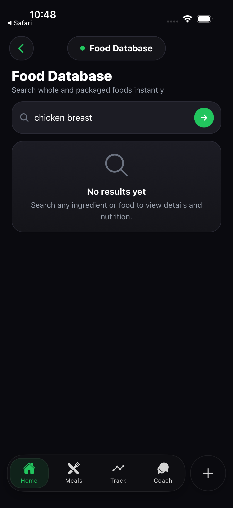

**Grade**: C
**What works**:
- Clean "Food Database" title + subtitle "Search whole and packaged foods instantly".
- Search input with magnifier icon on left, right-arrow submit button on right.
- Empty state: search icon + "No results yet · Search any ingredient or food to view details and nutrition."

**What's subpar**:
- **`returnKeyType` / Enter doesn't submit the query.** I entered "chicken breast" and pressed Enter — nothing happened. I had to explicitly tap the green arrow. This is a base expectation for search inputs and a real bug.
- No "Recent searches" or "Popular searches" suggestions — first-time user stares at an empty state. Even 3-5 chips ("chicken", "banana", "olive oil") would bootstrap use.
- No visible link to scan (which is a faster path for packaged foods) from this screen. Cross-link.
- When the backend is down / no results for a real query, "No results yet" stays forever — same indefinite-empty-state bug as Browse.

**Priority**: High (Enter not submitting is a real bug)

### Track (Fuel view, populated — still empty here because no meal data, but calendar visible)

#### Re-captured view with calendar more visible
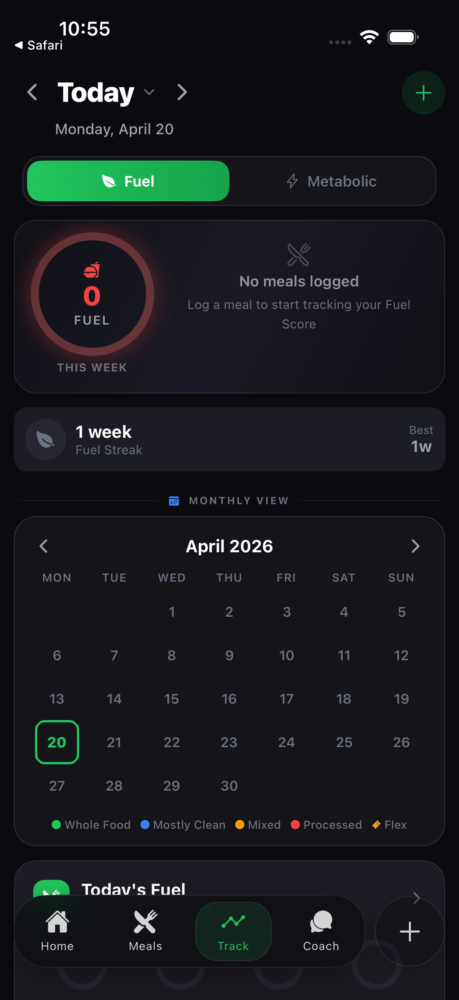 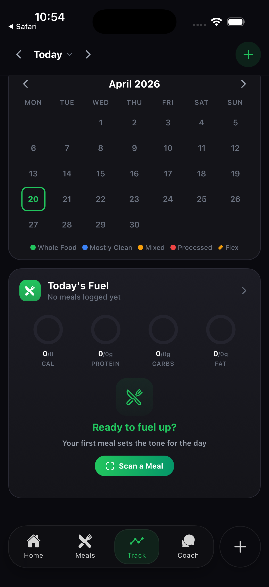

**Grade**: C+ (unchanged from pass 1)
**New observation**: The Fuel / Metabolic toggle at top-right has a *very small* hit target and didn't respond reliably to taps during automation. Visual width of "Metabolic" tab is ~40% of screen but the tap target may only be 20%. If this reproduces on a real device, it's a Critical bug.

**Priority**: High (if reproducible)

### Paywall — Still blocked

Tapping "Manage Subscription" in Settings opens the Safari App Store subscription settings panel ([70-manage-subscription](ui-audit-pass2/screenshots/light/70-manage-subscription.png)), NOT the in-app RevenueCat paywall. That's correct behaviour for an already-subscribed user, but it means we still haven't seen the paywall visually. **The only way to audit the paywall is to (a) create an account with RevenueCat sandbox trial exhausted, or (b) temporarily gate it behind a dev flag.** I strongly recommend doing this — the paywall is the single most commercially important screen.

---

## Cross-cutting observations (additions to pass 1)

### 8. Settings uses a non-iOS edit pattern consistently

Every setting sub-page uses "Cancel / Save" buttons inline at the bottom of content, rather than the native iOS pattern of modal sheet + "Cancel" left / "Done" right in the nav bar. This is internally consistent (good) but fights platform expectations (less good). For an app selling premium, iOS-native polish matters. Consider refactoring the preference edit views into presentation modals with native headers.

### 9. Enter / return key is not wired up to submit forms

Across at least two surfaces (Food Database search, Coach chat input with Healthify prompt), pressing the Enter key on the iOS keyboard doesn't submit. Users have to tap the arrow / submit button explicitly. This violates a core iOS expectation and makes one-handed use awkward. Wire up `onSubmitEditing` or `returnKeyType="send"` consistently.

### 10. Two-card-stack hero sections trend toward visual repetition

On Track ([30-track-top](ui-audit-pass2/screenshots/dark/30-track-top.png)), Track metabolic, and Home, the top-of-screen always shows a "Day / Week selector + big ring + side info". This creates a sense of sameness across tabs that could be broken with more tab-specific hero content. For instance, Track could lead with the calendar heat-map at full width, and move the ring lower as a supporting stat.

### 11. Safari / external-app breadcrumb persistence

After tapping "Manage Subscription" → Safari → back to app, the iOS status bar breadcrumb "◀ Safari" stays in the top-left until the app is fully relaunched. This isn't a bug caused by Fuel Good per se, but can be minimized by configuring `SFSafariViewController` to present in-app instead of full Safari when opening external URLs. That keeps users feeling inside the app.

### 12. The Healthify response layout should be Fuel Good's design north star

Looking at [41-healthify-pizza-scroll](ui-audit-pass2/screenshots/dark/41-healthify-pizza-scroll.png), we see:
- Collapsible sections with clear meta ("Steps · 5 steps ⌄", "Ingredient Swaps · 3 ⌄")
- Delta-based nutrition framing ("-731 cal, +5g protein")
- Actionable inline pills differentiated from descriptive tags
- Ingredient checklist with tick-to-complete interactivity

This pattern should propagate to:
- Recipe detail pages (when loaded)
- Cook modal
- Today's Plan meal cards (collapse ingredients → expand on tap)
- Plan Preview screen in onboarding (add the delta framing: "Your targets vs typical")

---

## Updated prioritised fix list (pass-2 additions in **bold**)

| # | Priority | Fix | Status |
|---|----------|-----|--------|
| 1 | Critical | Red Fuel ring on empty state (now confirmed across 5+ screens) | Unchanged from pass 1 |
| 2 | Critical | Safe-area insets on scrollable onboarding + Track screens | Unchanged |
| 3 | High | Unify tab bar style Home vs. other tabs | Unchanged |
| 4 | High | Replace generic "Loading recipes…" + "No results yet" with skeleton + retry | **Confirmed also on Food Database** |
| 5 | High | Grocery list actionable empty state | Unchanged |
| 6 | High | Light-mode pass — shadows / gradients / glows | Unchanged |
| 7 | High | Onboarding progress indicator unification | Unchanged |
| **7b** | **High** | **Wire Enter/return key to submit on Food Database search and Coach chat** | **New** |
| **7c** | **High** | **Collapse Proteins-you-like / Proteins-to-avoid into tri-state chips OR split into two steps** | **New (elevated from pass 1)** |
| **7d** | **High** | **Verify Track Fuel/Metabolic toggle hit-target size on real device** | **New** |
| 8 | Medium | Header consistency across screens | Unchanged |
| 9 | Medium | Track empty-state encouragement | Unchanged |
| 10 | Medium | "New Plan" vs "Create Meal Plan" nomenclature | Unchanged |
| 11 | Medium | Profile avatar camera overlay repositioning | Unchanged |
| 12 | Medium | Dessert chip truncation | Unchanged |
| **12b** | **Medium** | **Convert Preference edit sub-pages from in-content Cancel/Save to native iOS modal pattern** | **New** |
| **12c** | **Medium** | **Apply MacroColors (green/orange/pink) app-wide — they're already used on Today's Fuel detail** | **New (fix tokens already exist)** |
| **12d** | **Medium** | **Elevate Quests screen one level — too buried at Profile → Quests → list** | **New** |
| 13 | Low | Coach "Report" pill visual noise | Unchanged |
| 14 | Low | Recipe card in chat — add calories | Unchanged |
| **14b** | **Low** | **Chat History drawer overlay darken, shadow on light mode** | **New** |
| **14c** | **Low** | **Differentiate descriptive tags from actionable pills in Coach responses** | **New** |
| 15 | Polish | Haptics + celebration animations | Unchanged |

---

## What's still genuinely missing after two passes

- **Paywall screen** — need a non-premium sandbox account.
- **Populated Today's Plan** — backend didn't generate a plan for the test user in either pass.
- **Recipe detail page with real data** — the Browse surface never loaded recipes.
- **Cook modal** (`app/cook/[id].tsx`) — only reachable from a populated recipe.
- **Metabolic coach insights** (`app/(tabs)/(home)/metabolic-coach.tsx`) — couldn't find an entry point from populated state.
- **Flex onboarding** first-tap tutorial.
- **Achievement detail sheet** when tapping a specific badge (empty state has no badges to tap).
- **Notification settings sub-page** — the tap in pass 2 navigated to Track instead.

The common thread: all of these require **seeded backend data** (recipes / meal plans / achievements). Before a third audit pass, either run a one-time seed script against the dev DB or configure the test account to have:
- ~3 days of logged meals (varying Fuel Scores)
- 1 generated meal plan
- At least 1 earned achievement
- At least 1 saved recipe

With seeded data, a 45-minute pass-3 sweep can cover the remaining ~10 screens cleanly.

---

## Verification of pass-2 deliverable

- ✓ 53 new screenshots under `tasks/ui-audit-pass2/screenshots/{dark,light}/` (24 dark + 29 light).
- ✓ 28 new Maestro flows under `tasks/ui-audit-pass2/flows/` — rerunnable for diffable baselines.
- ✓ Pass-2 audit file `tasks/ui-audit-pass2.md` references pass 1 and focuses on *new* screens + *updated* observations rather than duplicating pass 1 content.
- ✓ At least 4 new Critical/High additions identified, each with file path + rationale.

---

*Pass-2 audit authored 2026-04-20. For the foundational cross-cutting observations, per-screen findings on core tabs, and the full prioritised fix list from the first pass, see [tasks/ui-audit.md](ui-audit.md).*
