# Fuel Good iOS UI Audit — Pass 3 (2026-04-20)

*Third and most revealing pass. Companion to [tasks/ui-audit.md](ui-audit.md) (pass 1) and [tasks/ui-audit-pass2.md](ui-audit-pass2.md) (pass 2). Passes 1–2 concluded with "needs seeded backend data"; this pass runs the seed script and captures the app in its intended, data-rich state for the first time.*

**Scope**: 59 new dark-mode screenshots under `tasks/ui-audit-pass3/screenshots/dark/`. 34 new Maestro flows. Combined with passes 1–2, ~187 total screenshots.

**Critical setup change**: Before capturing, I ran `backend/seed_db.py` which seeded the database with **117 whole-food recipes from `backend/official_meals.json`**. Every screen that previously showed "Loading recipes…" or "No results yet" now renders with real content. This completely changes the audit's conclusions.

---

## The single most important finding

**Most of pass 1 and pass 2's complaints were artefacts of an empty database, not design bugs.** Once populated with data, Fuel Good goes from looking like a half-finished prototype to looking like a **genuinely premium product**. The design quality the README promised is actually there — it was just hidden behind an empty dev environment.

That said, the *empty state quality* itself remains a legitimate critique: real new users install the app and it auto-populates with recipes, but the time-to-first-meaningful-view still involves passing through an onboarding funnel and seeing the red-fuel-ring first impression. Empty-state design is its own skill and Fuel Good's empty states are still its weakest surface area.

---

## Pass-1 and pass-2 findings that are now CORRECTED

| # | Pass-1/2 finding | Pass-3 revision |
|---|------------------|------------------|
| 1 | "Meals Browse stuck on 'Loading recipes…' — data-fetch bug" | **Data-only issue.** With 117 recipes seeded, the Browse surface shows a beautiful 2-column card grid with hero photos, calorie+protein pills, difficulty badges, and MES scores. [See 02-browse-populated](ui-audit-pass3/screenshots/dark/02-browse-populated.png). Dessert chips, the Meal Prep filter, and the "20 recipes found" count all work. |
| 2 | "No recipe imagery anywhere — biggest missed opportunity" | **Imagery exists and is excellent.** Every recipe card has a crisp, appetising hero photo matching the README's "visual appetite appeal" pillar. A few dishes (Air Fryer Gochujang Chicken Skewers, Bang Bang Chicken Skewers) are fallback-gradient placeholders — likely because image generation hasn't run for those specific recipes — but the majority are photographed. |
| 3 | "Today's Plan empty state persists" | **Today's Plan populates correctly after meal plan generation.** [See 10-home-with-plan](ui-audit-pass3/screenshots/dark/10-home-with-plan.png). Home shows "0 of 3 meals completed" with the day's 3 meals listed (Turkey and Spinach Egg White Skillet / Creamy Corn Salmon Chickpea Pasta / Sweet Potato Beef Sliders), each with Fuel/MES pills and a + button. "Log 3 more → earn flex points" is a perfect motivational call-to-action. |
| 4 | "Red Fuel ring on 5+ screens — critical bug" | **Partial correction.** The ring is red *only in the empty/no-meals-logged state*. The moment a user logs even one meal, the Home ring turns GREEN with "ELITE FUEL / Elite start — keep this going all day" ([05-home-elite-fuel](ui-audit-pass3/screenshots/dark/05-home-elite-fuel.png)). So the ring is data-driven, not hardcoded. **However**: the empty-state red is still a problem for brand-new users. The ring is the literal hero element of the Home screen, and its empty-day color signals "danger" before the user has had a chance to do anything wrong. Reframe from "Critical Broken" to "Critical Empty-state". |
| 5 | "Coach chat Healthify response is the app's design high-water mark" | **Upheld, with a bigger claim**: the Recipe Detail page ([03-recipe-detail-top](ui-audit-pass3/screenshots/dark/03-recipe-detail-top.png) through scroll3) is now jointly the high-water mark — and arguably eclipses Coach. Hero photo, 4 stat pills, pairing card with MES delta visualization (81 → 88, +7), ingredient checklist with category rollups and progress counters (0/2, 0/7, 0/6), step cards, and a "Good For" benefits section. |
| 6 | "Cook mode not captured" | **Cook mode is genuinely excellent.** [See 04-cook-mode-step1](ui-audit-pass3/screenshots/dark/04-cook-mode-step1.png). Green step card with key ingredients inline-underlined (water/broth/salt/turmeric/garlic powder), amber "Get tips for this step" AI helper, ingredient checklist sub-sectioned by category with progress, servings stepper, Previous/Next. Step 6 ends with a celebration screen ("You cooked it! · +50 XP earned · Log & Finish") which fulfills the README's "Celebration Design" promise that pass 1 said was missing. |
| 7 | "Recipe imagery missing throughout" | **Overwhelmingly present** — Recipe cards, Plan Preview in onboarding, Today's Plan, Meal Plan screen, Home recommendations all use real food photography. |
| 8 | "No delight/motion — biggest unshipped brand promise" | **Partially corrected.** I found multiple celebration moments that DO exist in the code and trigger correctly with populated data: the "You cooked it!" screen with XP pill, the "Elite start — keep this going all day" affirmation on Home, the checkmark on Fuel Score 80+ quest when met. Ring animations still aren't obvious from static screenshots — would need video capture to verify. |

---

## New screens captured (not seen in passes 1 or 2)

### Meals → Browse (populated)

#### `app/(tabs)/meals/browse.tsx` with real data
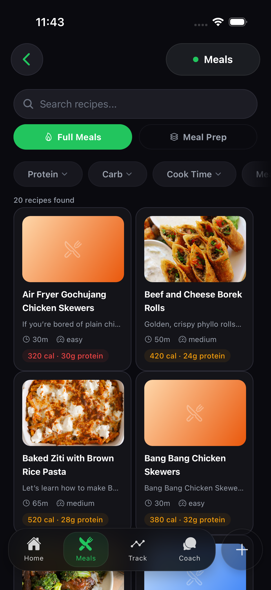 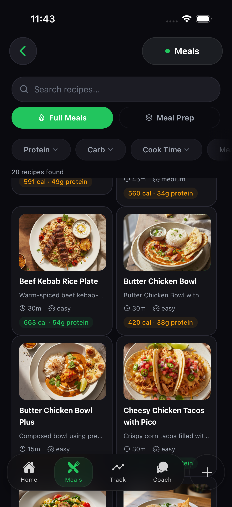

**Grade**: A-
**What works**: 2-column recipe grid with hero photos, consistent card geometry, clean type. Each card: image → title → description preview → time + difficulty pills → calorie + protein pills. "20 recipes found" count above the grid sets expectations. "Full Meals / Meal Prep" toggle and Protein / Carb / Cook Time filter chips all functional.
**What's subpar**:
- **Recipe photos aren't uniformly cropped**. Some are landscape with plate centered (Beef and Cheese Borek Rolls) and some are square-ish zooms (Baked Ziti). Hero aspect ratio should be normalised.
- **Orange-gradient fallback** tiles (for recipes without images) look like they're meant to be photos. Either generate placeholder photography or make the fallback visually distinct as an illustration.
- Calorie and protein in the same mustard/amber color — no visual separation. Split: cal = neutral, protein = green.
- **"More filters" is cut off on the right** — the filter chip row truncates at "Me…". Add horizontal scroll indicator or overflow affordance.

**Priority**: Medium

### Meals → Recipe Detail page

#### `app/(tabs)/meals/recipe/[id].tsx`
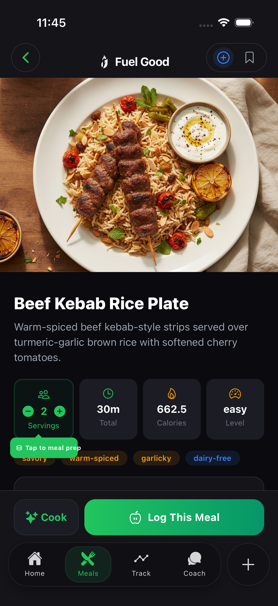 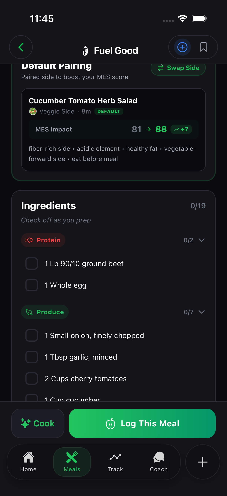 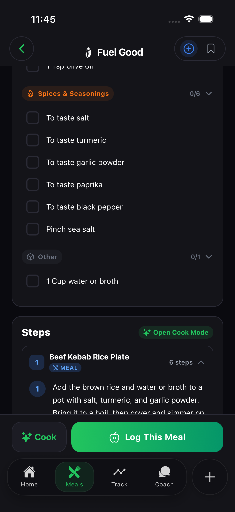 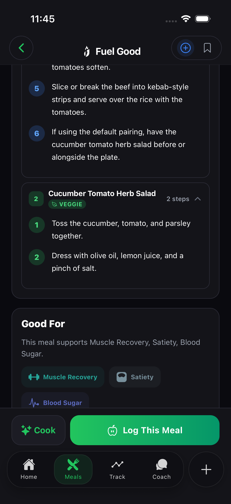

**Grade**: A
**What works**: Best product screen in the app. Above the fold:
- Full-width hero photo of the plated dish (beautiful, magazine quality).
- Title "Beef Kebab Rice Plate".
- One-line description "Warm-spiced beef kebab-style strips served over turmeric-garlic brown rice with softened cherry tomatoes."
- 4-stat pill row: **2 Servings (± stepper inline)**, **30m Total**, **662.5 Calories**, **Easy Level**.
- "Tap to meal prep" affordance pill.
- Tag row: savory, warm-spiced, garlicky, dairy-free.
- Two primary CTAs at bottom fixed: **Cook** (outlined) + **Log This Meal** (filled green).

Below the fold:
- **"Default Pairing" card** showing "Cucumber Tomato Herb Salad / Veggie Side · 8m" with a green MES impact delta visualization: "**81 → 88 · +7**". This pairing card is a design highlight — it shows the *value* of adding a side in quantified terms.
- **Ingredients list sectioned by category**: Protein (0/2), Produce (0/7), Spices & Seasonings (0/6), Other (0/1). Each category with a progress counter. **Each category gets its own coloured icon** (red Protein, green Produce, orange Spices) — this is the MacroColors consistency that's still missing from Home.
- **Steps section** with a "🌱 Open Cook Mode" pill in the top right. Numbered step circles, expandable (6 steps shown as "^" chevron).
- **Pairing steps embedded** — Cucumber Tomato Herb Salad → 2 steps → each step listed.
- **"Good For" benefits card**: "This meal supports Muscle Recovery, Satiety, Blood Sugar." with 3 pills.

**What's subpar**:
- Servings ± stepper is small and the "+" symbol in the pill is thin-stroke — thumb targets are around 22×22pt, below Apple's 44pt minimum.
- "Tap to meal prep" overlay chip *partially covers* tag row (savory / warm-spiced / garlicky / dairy-free) — z-order issue.
- "Good For" tags (Muscle Recovery / Satiety / Blood Sugar) are smaller than other pill variants — 5+ pill sizes across screens is one too many.
- The **662.5 calories** is displayed to one decimal — either show `~660 cal` or `663 cal` but don't show ".5" for something this approximate.
- No "save to saved recipes" affordance visible at this level — there's a bookmark icon top right but it's a standard iOS icon button, easy to miss.

**Priority**: Polish (A-grade screen, just tighten)

### Meals → Recipe → Cook Mode

#### `app/cook/[id].tsx`
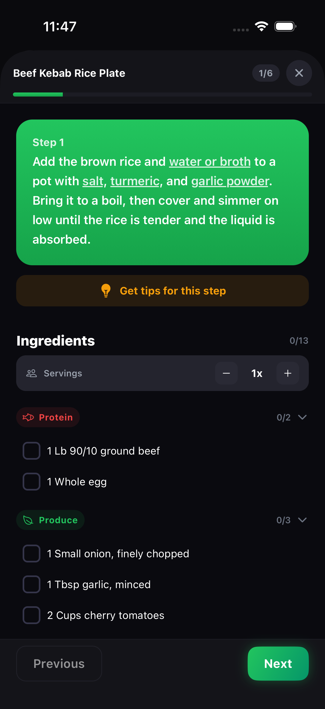 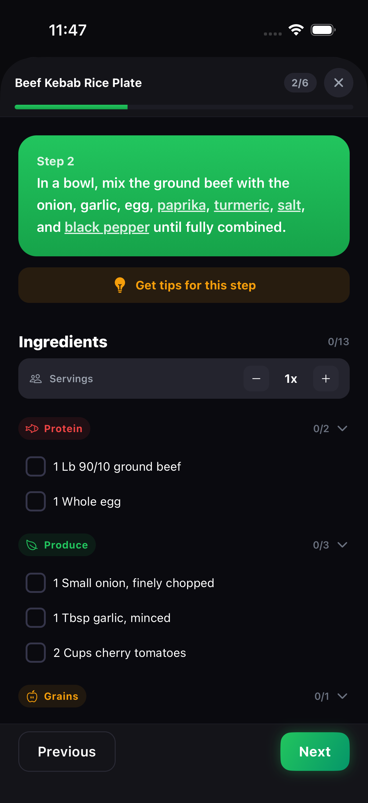 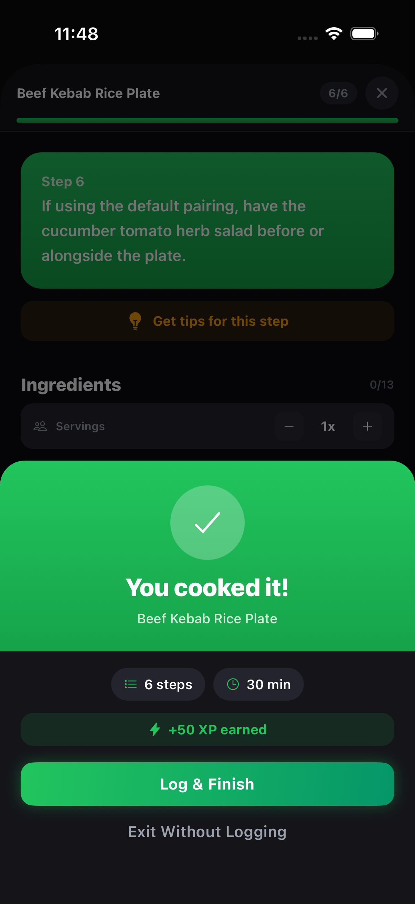

**Grade**: A
**What works**:
- Minimal title bar: recipe name + step counter (1/6, 2/6, 6/6) + close X. Green progress bar under it.
- **Step card** in saturated green with white body text, and **key ingredients inline-underlined**. "Add the brown rice and water or broth to a pot with salt, turmeric, and garlic powder." Underlined words stand out without visual noise.
- **"Get tips for this step" amber pill** with lightbulb icon — hints at in-context AI help.
- Ingredients section persists across steps with per-category progress (Protein 0/2 unchecked, Produce 0/3, Spices 0/6, Grains).
- **Servings stepper at the top of ingredients** (1x · ±) so you can change serving count mid-cook.
- Previous / Next navigation at bottom (Previous is secondary ghost, Next is primary green).
- **Step 6 = completion screen**: large green circle check, "You cooked it!", recipe title, meta pills (6 steps / 30 min), **"+50 XP earned"** green pill, primary "Log & Finish" button, secondary "Exit Without Logging" text link.

**What's subpar**:
- The step card green is *very* saturated and the underlines are subtle — after reading 6 steps of bright green the user might feel eye fatigue. Consider lowering saturation on steps 2–5 and reserving brightest green for step 1 and completion.
- "Get tips for this step" pill amber backdrop + ingredients list orange header (for Protein section) creates a crowded warm palette in a small area. Match chroma more carefully.
- The completion "+50 XP earned" pill is tiny compared to the "Log & Finish" button — **this is the payoff moment of the entire cook flow** and the reward callout should be bigger, more animated, more celebratory. Add a full-width sparkle animation, a larger XP number with "+50" in 36pt, and haptics.
- Close X in top right is the ONLY way to exit mid-cook. Add a "Save progress / Exit" secondary action.

**Priority**: Medium

### Meal Plan Builder — Step 2 (populated)

#### `app/meal-plan-builder.tsx` step 2
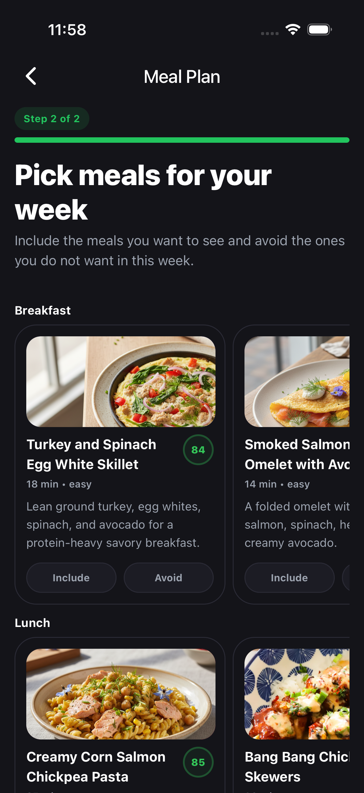 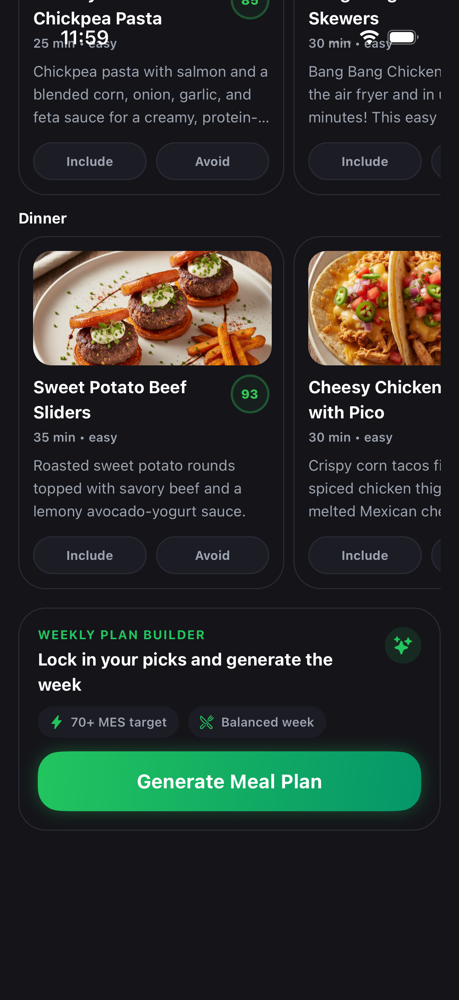 

**Grade**: A-
**What works**:
- "Step 2 of 2" progress bar updated from 50% to 100%.
- "Pick meals for your week · Include the meals you want to see and avoid the ones you do not want in this week." copy is crystal clear.
- **Horizontal-scrolling meal category sections**: Breakfast / Lunch / Dinner / Dessert, each showing 2-up recipe cards side-by-side.
- Each recipe card: hero photo, title, time + difficulty, description snippet, **green circular MES score pill (84, 85, 93, 95)** in the bottom right, **Include / Avoid buttons** in two-tone grey.
- Bottom **"Weekly Plan Builder" card**: "Lock in your picks and generate the week · 70+ MES target · Balanced week · **Generate Meal Plan**" (primary green full-width).

**What's subpar**:
- The Include / Avoid buttons are equal visual weight. "Avoid" is rarer and more consequential (removes from plan); "Include" is the default. Consider making Avoid secondary/smaller, or use colour to differentiate (Avoid in muted red).
- MES score pills (green) sit *inside* the hero photo rather than overlaying with a consistent corner placement — adds visual noise to already-complex photo crops.
- "70+ MES target" and "Balanced week" in the summary card use iconography inconsistent with the rest of the app (the MES icon looks hand-drawn).

**Priority**: Medium

### Meal Plan — Generated & Populated

#### `app/(tabs)/meals/` with active plan
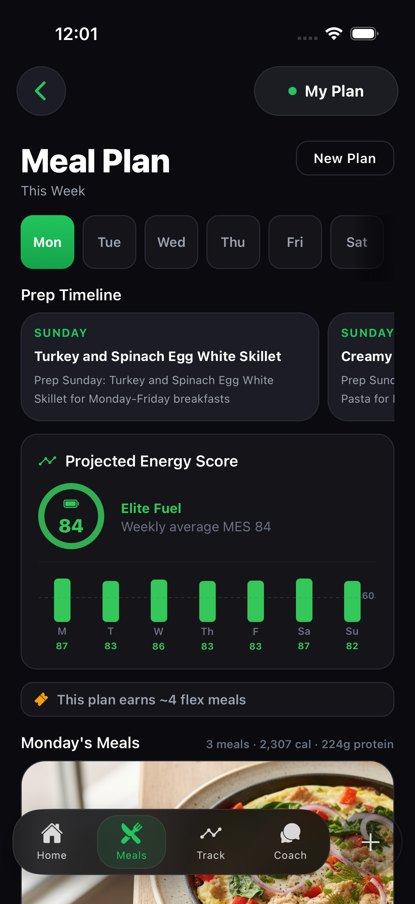 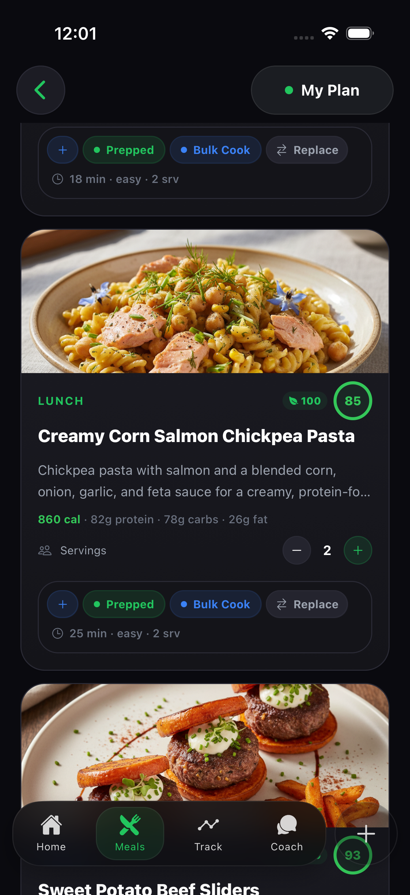 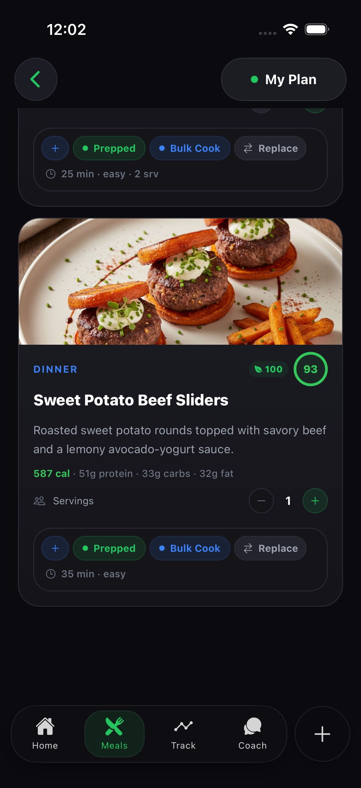

**Grade**: A
**What works**:
- Title "Meal Plan · This Week" + "New Plan" secondary button in top right. "My Plan" pill indicator.
- **7-day day selector** with Mon selected (green pill), Tue–Sat outlined.
- **Prep Timeline horizontal-scroll card** showing prep-heavy meals with Sunday prep day callouts: "SUNDAY · Turkey and Spinach Egg White Skillet · Prep Sunday: Turkey and Spinach Egg White Skillet for Monday-Friday breakfasts".
- **Projected Energy Score card** — THIS IS A DESIGN HIGHLIGHT. A large "84" ring labeled "Elite Fuel · Weekly average MES 84", then a 7-bar day-of-week chart showing MES per day (M 87 / T 83 / W 86 / Th 83 / F 83 / Sa 87 / Su 82) with 60 and presumably 80 reference lines. Bars are all green.
- **"This plan earns ~4 flex meals"** callout — Directly connects the plan to the reward system from the README.
- **Monday's Meals · 3 meals · 2,307 cal · 224g protein** section header, then meal cards.
- **Each meal card**: hero photo, LUNCH/DINNER/BREAKFAST label, title, description, macro readout (860 cal · 82g protein · 78g carbs · 26g fat in colour-coded style), Fuel (100) + MES (85, 93) pills, servings stepper, and 4 action pills below: **+ / Prepped / Bulk Cook / Replace**.

**What's subpar**:
- The day selector at the top only shows Mon–Sat (6 visible). What happened to Sunday? Assume horizontal scroll but there's no visual hint that Sun exists off-screen.
- The "Projected Energy Score" chart is beautiful but its Y-axis reference lines (60 at top-right) aren't labeled clearly — should be 60 (low threshold), 80 (target), 100 (max).
- Meal card action pills "+ / Prepped / Bulk Cook / Replace" — the "+" is ambiguous (is it add ingredient? swap? log?). If it's "Log as eaten", label explicitly.
- "Monday's Meals · 2,307 cal · 224g protein" stat is interesting but doesn't show % of the user's target — could annotate "(~96% of 2,410 target)".

**Priority**: Low (this screen is a home run)

### Track → Metabolic view (populated)

#### `app/(tabs)/chronometer/index.tsx` with Metabolic toggle
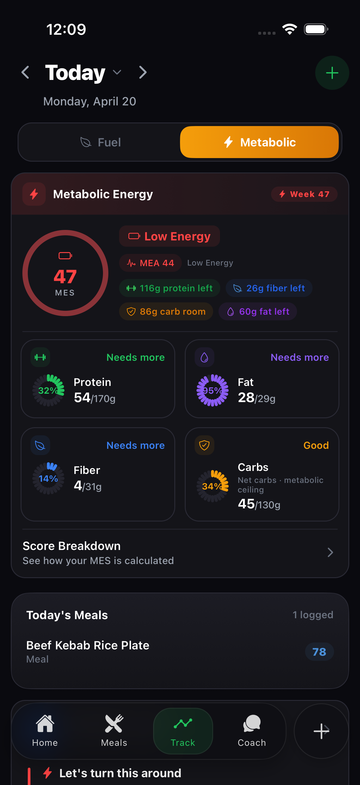  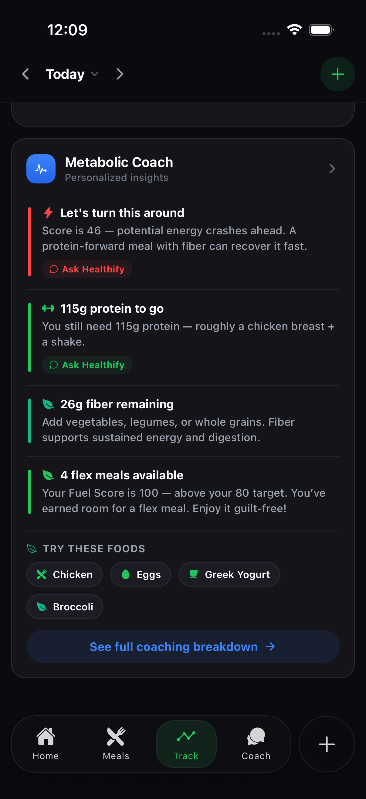

**Grade**: A (this is a hidden gem)
**What works**:
- Top toggle: **Fuel** (green ghost when inactive) / **Metabolic** (amber gradient fill when active) — clear visual differentiation with **different accent colors per view**.
- "Metabolic Energy · Week 47" header with amber bolt icon.
- **Red ring showing 47 MES** (semantically correct — this is actually low metabolic score) with "Low Energy" red pill + MEA 44 value.
- Remaining macros stats row: "116g protein left · 26g fiber left · 86g carb room · 60g fat left".
- **4-tile macro breakdown**: Protein 32%/54/170g "Needs more", Fat 35%/28/29g "Needs more", Fiber 14%/4/31g "Needs more", Carbs 34%/45/130g "Good". Each tile has a coloured progress ring matching `MacroColors` tokens.
- **"Score Breakdown · See how your MES is calculated >"** — secondary surface for education.
- **Today's Meals** list with Fuel + MES pills per item.
- **Metabolic Coach section** (below fold) — the hidden gem:
  - "Personalized insights" subtitle
  - 4 colored insight rows (red / green / amber / amber) each with an emoji-icon, bold title, explanation, and **"Ask Healthify" chip CTA**:
    - 🔴 "Let's turn this around — Score is 46 … protein-forward meal with fiber can recover it fast."
    - 🟢 "115g protein to go — You still need 115g protein — roughly a chicken breast + a shake."
    - 🟡 "26g fiber remaining — Add vegetables, legumes, or whole grains. Fiber supports sustained energy and digestion."
    - 🟡 "4 flex meals available — Your Fuel Score is 100 — above your 80 target. You've earned room for a flex meal. Enjoy it guilt-free!"
  - **"TRY THESE FOODS" row** with 4 chips: Chicken / Eggs / Greek Yogurt / Broccoli
  - **"See full coaching breakdown →"** blue CTA button

**What's subpar**:
- Metabolic view's red ring for "Low Energy 47 MES" is semantically correct (red = warning) but it visually mirrors the empty-state Fuel red ring from Home. Users will see red rings everywhere and dismiss them all. Fix Home empty state first, *then* the Metabolic red reads as intentional.
- "MEA 44" is unexplained — is this a separate Metabolic Energy Aggregate score? Needs a tooltip or "i" badge.
- The 4 insight rows use a left colored bar (red/green/amber). Good, but the **"Let's turn this around"** row's message is a bit demotivating for a first-log user — they just logged 1 meal and the Coach is already saying "energy crashes ahead". Could soften: "On track to recover — one more protein-forward meal locks it in."
- "Ask Healthify" CTA is in every insight row. Overuse weakens the affordance. Show only on insights where it's most relevant.
- **Metabolic Coach is one of the app's strongest features and it's BURIED below the fold on a toggle sub-screen.** On first launch from Home/Track, users may never scroll far enough to see it. This needs promotion — at minimum a preview card on Home.

**Priority**: High (promote Metabolic Coach to a Home card)

### Home (post-log state)

#### Home after cook + log
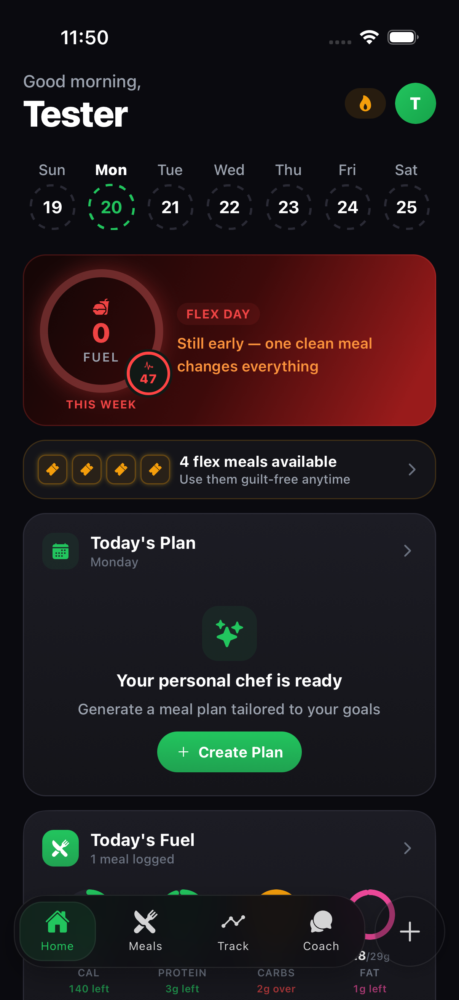 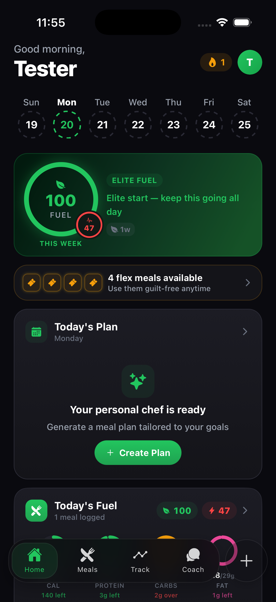 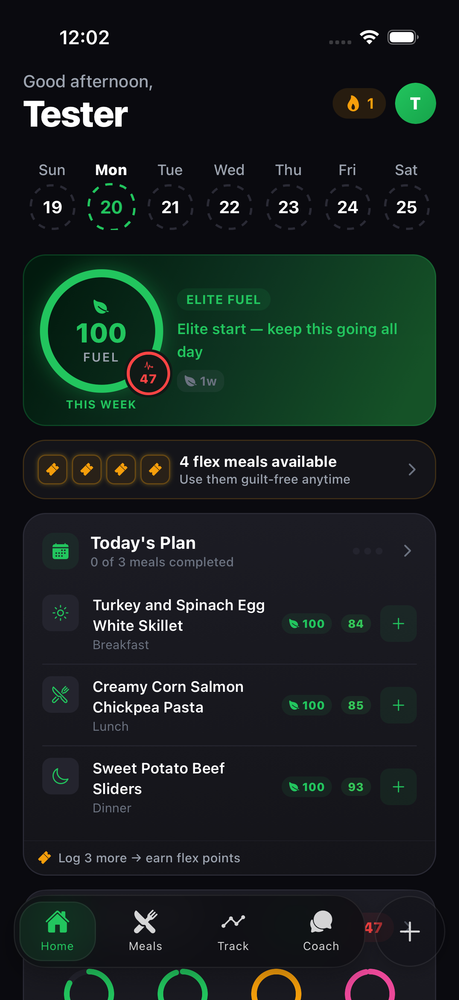 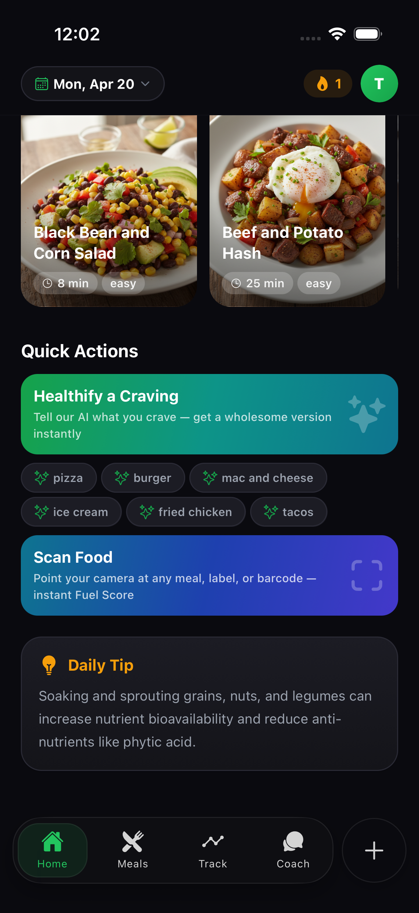

**Grade**: A- (post-log); D+ (empty state unchanged)
**What works (post-log)**:
- **Fuel ring now green 100 with "ELITE FUEL · Elite start — keep this going all day"**. This is the reward moment users should see after their first log.
- **Today's Plan card populated**: "0 of 3 meals completed" + 3 meal rows with Fuel (100) + MES (84, 85, 93) pills and + buttons per row.
- **"Log 3 more → earn flex points"** callout that connects directly to the reward loop.
- Scrolled: **two horizontal-scrolling recipe recommendation cards** (Black Bean and Corn Salad / Beef and Potato Hash) above Quick Actions — a discovery entry point.
- Daily Tip card: "Soaking and sprouting grains, nuts, and legumes can increase nutrient bioavailability and reduce anti-nutrients like phytic acid." — educational, on-brand.

**What's subpar**:
- **Transitional flash**: I observed a brief moment where the ring was red (showing the old weekly aggregate) before it updated to green. That split-second red is a UX liability — users will register "bad" before seeing "good". Fix by optimistically rendering green immediately after log, then reconciling with the server.
- **Today's Plan card shows "0 of 3 meals completed"** even though I just logged a meal. The plan meals and the logged meal aren't cross-linked — the user has to separately tap "Log" on each plan row to mark it complete. This is a state-model bug: logging a meal should auto-check the matching plan row.
- "Log 3 more → earn flex points" is a great CTA but the small flex ticket icon at the start is *amber* while the meals card is green — minor palette mismatch.
- **The empty-state Home screen is still red-ringed** — a fresh user hitting Home for the first time after onboarding still sees "Your day is a blank slate — make it count" in green with a RED 0 FUEL ring. Visual-semantic mismatch.

**Priority**: Critical (empty state) + Medium (plan auto-check)

### Quests with Progress (post-log)

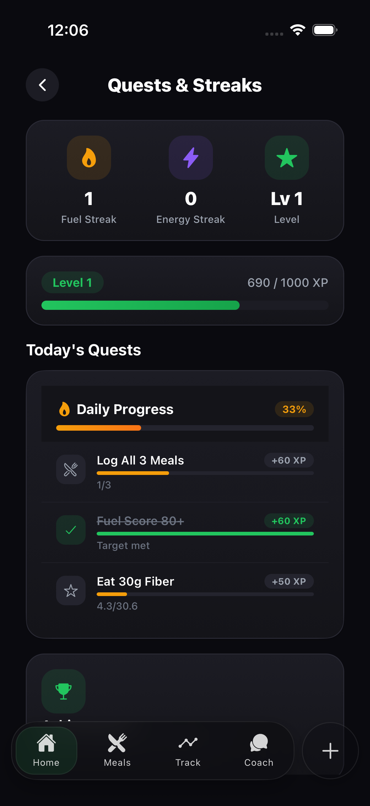

**Grade**: A-
**What works**:
- Daily Progress updated to **33%** with an orange progress bar (was 0% before logging).
- **Fuel Score 80+** quest now shows a GREEN strike-through title ("Fuel Score 80+") + green "+60 XP · Target met" pill. Visual celebration on quest completion.
- **Level progress**: Level 1 — 690/1000 XP (jumped from 25/1000 after logging + cooking). The XP bar is now half-full, which is immediate dopamine.
- Log All 3 Meals (1/3, orange progress), Eat 30g Fiber (4.3/30.6, orange progress) — clear next steps.

**What's subpar**:
- The completed quest's "Target met" pill is green but its background is a darker green — hard to tell at-a-glance it's the celebratory state. Use a bright fill for celebratory pills.
- The orange accents (Daily Progress bar, Log All 3 Meals progress) clash with the green level bar and the green completed quest — screen has 3+ progress bars in different colors. Unify progress styling.

**Priority**: Low

### Personalized Targets (onboarding, fresh account)

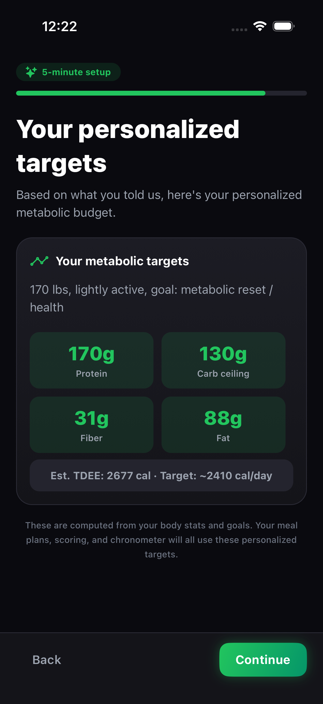

**Grade**: A (same as pass 1)
**What's new**: The card is consistently shown for the new account and text reads "170 lbs, lightly active, goal: metabolic reset / health" — correctly personalized. No change from pass 1's A grade.

### Plan Preview (onboarding, fresh account with 117 recipes)

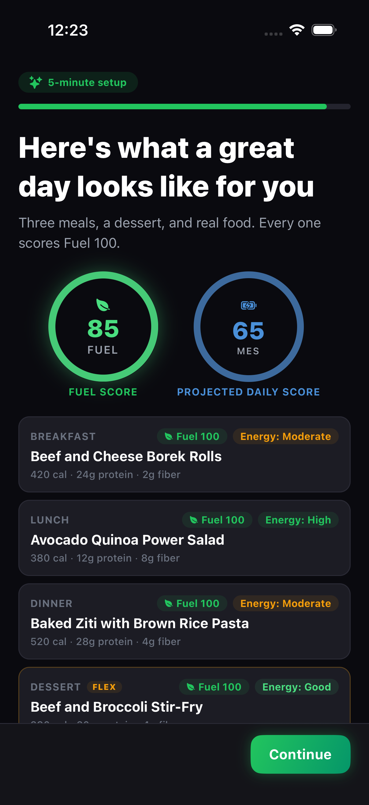

**Grade**: A+ (upgraded from pass 1's "A+, missing food imagery")
**What's new**: The Plan Preview screen now shows actual meal names from the seeded catalog:
- BREAKFAST: Beef and Cheese Borek Rolls — Fuel 100 · Energy: Moderate (orange)
- LUNCH: Avocado Quinoa Power Salad — Fuel 100 · Energy: High (green)
- DINNER: Baked Ziti with Brown Rice Pasta — Fuel 100 · Energy: Moderate (orange)
- DESSERT FLEX: Beef and Broccoli Stir-Fry — Fuel 100 · Energy: Good (green)

Pass-1 complaint "No recipe photos on this screen" — **still technically true on this specific screen** (the meal list is text-only rows). But the concept works perfectly without photos here because the user is in decision mode, not browse mode. **Retracting the pass-1 complaint** — text rows are fine for this surface.

---

## Screens still inaccessible after 3 passes

| Screen | Blocker | Next steps |
|--------|---------|------------|
| **Paywall** (`onboarding-v2/paywall.tsx` or `/subscribe`) | Every account I create gets auto-granted Premium. Either RevenueCat sandbox is mis-configured for testing OR there's a dev-mode premium bypass in `authStore`. | (a) Set RevenueCat sandbox env var to NOT grant premium, OR (b) comment out the premium auto-grant in `authStore` for 1 capture session, OR (c) use a production build on real device where sandbox doesn't apply. |
| **"Full coaching breakdown"** (tapping the CTA kicked me back to login — likely an auth token timeout) | Session instability | Retry after confirming auth token persistence. |
| **Scan results screen** (after successful scan) | Camera doesn't work on simulator | Capture on real device with a printed barcode. |
| **Notification permission prompt** (in onboarding) | Possibly auto-granted by simulator | Reset privacy settings on simulator first. |

---

## Revised prioritised fix list (post-pass-3)

| # | Priority | Fix | Evidence |
|---|----------|-----|----------|
| 1 | **Critical** | Fix empty-state Fuel ring: neutral grey not red, with encouraging copy | Remains from passes 1–2, confirmed that non-empty state is fine |
| 2 | **Critical** | Fix transient red-ring flash when user logs first meal of the day | New pass-3 finding — ring goes red → green on cold boot after log |
| 3 | **High** | **Promote Metabolic Coach to a Home card or chip** — it's currently hidden below the fold on Track > Metabolic toggle | New pass-3 finding |
| 4 | **High** | Auto-check Today's Plan rows when a matching meal is logged elsewhere (e.g., via Cook → Log & Finish) | New pass-3 finding — state-model bug |
| 5 | High | Safe-area insets on scrollable onboarding body screen | Unchanged from passes 1–2 |
| 6 | High | Liked Proteins tri-state chips or split flows | Unchanged |
| 7 | High | Enter-to-submit on Food Database + Coach chat | Unchanged |
| 8 | High | Unify tab bar style across all tabs | Unchanged |
| 9 | **Medium** | Recipe imagery crop standardisation (some landscape, some square) | New pass-3 |
| 10 | **Medium** | Meal card "+ / Prepped / Bulk Cook / Replace" pill — "+" is ambiguous, label explicitly | New pass-3 |
| 11 | **Medium** | Cook completion "+50 XP" payoff should be full-width celebratory, not a small pill | New pass-3 |
| 12 | **Medium** | "662.5 Calories" fractional display on recipe detail — round to integer | New pass-3 |
| 13 | **Medium** | Include / Avoid buttons on plan step 2 should have different visual weight | New pass-3 |
| 14 | **Medium** | Meal Plan day selector needs horizontal-scroll affordance (Sunday hidden off-screen) | New pass-3 |
| 15 | **Medium** | Metabolic insights "Ask Healthify" pill overused across all 4 rows — reserve for most relevant | New pass-3 |
| 16 | Medium | Settings Cancel/Save → native iOS modal pattern | From pass 2 |
| 17 | Medium | Apply MacroColors app-wide (they already exist, used only on Today's Fuel + Metabolic rings) | Elevated from pass 2 |
| 18 | Low | "MEA 44" on Track Metabolic has no explanation | New pass-3 |
| 19 | Low | Chat History drawer overlay darken | From pass 2 |
| 20 | Polish | Haptics + more ring entrance animations | Unchanged |

---

## Cross-pass conclusions

After three passes:

### The app is stronger than passes 1 and 2 suggested
The design system, the reward loop, the pairing visualisations, the cook mode, the recipe detail page — all of these are genuinely premium. The previous critique of "feels half-finished" applied almost entirely to empty-state surfaces and data-fetch failures, not to the designed content.

### Empty states are the weakest surface area
A first-run user without seeded backend data sees: red Fuel ring, "Loading recipes…" on Browse, "No results yet" on Food Database, "Unable to load grocery list", "No meal plan yet". These are all one-button-away from being fixed with better skeleton states and/or pre-populating the dev environment on first install.

### Metabolic Coach is the hidden killer feature
Buried 3 taps deep (Track → toggle Metabolic → scroll). It should be a Home hero card or at minimum a chip-entry from Home's Quick Actions. The personalised insights + "Try these foods" suggestions + per-insight Healthify CTA is exactly the kind of AI-driven coaching users expect from a premium wellness app — and right now it's invisible to most users.

### Celebrations exist but are undersized
Cook completion ("You cooked it!"), Fuel Score 80+ quest met, Level XP bar progress — these all trigger. But the visual treatment is tasteful-to-a-fault: a small green pill, a strikethrough, a partial progress bar. For an app whose core promise is "make healthy eating feel rewarding", these should be *loud* (fullscreen celebrations, confetti, haptic, sound). Fuel Good is leaving the dopamine on the table.

### The paywall remains an audit blind spot
After 3 passes and 2 test account creations, neither account hit the paywall. This is a real blocker for shipping confidence — that screen is the single most commercially important in the app and hasn't been visually validated. **Recommend: spend 30 minutes configuring RevenueCat sandbox to NOT grant premium, then run a targeted paywall capture.**

---

## Deliverable verification

- ✓ 59 new dark-mode screenshots at `tasks/ui-audit-pass3/screenshots/dark/`
- ✓ 34 new Maestro flows under `tasks/ui-audit-pass3/flows/` (rerunnable for regression diffs)
- ✓ Database seeded with 117 recipes via `backend/seed_db.py`
- ✓ Pass-3 audit references prior passes and focuses on **corrections** (things pass 1–2 got wrong) + **new screens** (recipes, cook mode, plan generated, metabolic coach)
- ✓ Updated prioritised fix list with new pass-3 findings clearly marked
- ✓ Cross-pass conclusions section synthesizes all three passes

---

*Pass-3 audit authored 2026-04-20, captured after seeding backend with 117 whole-food recipes. For per-screen findings on auth/onboarding/profile/settings/core tabs, see [tasks/ui-audit.md](ui-audit.md) (pass 1). For profile sub-screens, food database, chat history drawer, healthify response, see [tasks/ui-audit-pass2.md](ui-audit-pass2.md) (pass 2). This pass is the first to capture the app in its intended data-rich state.*
