# Fuel Good iOS UI Audit — 2026-04-18

*Audit scope: every user-facing screen in the Fuel Good iOS app, captured live on iPhone 17 Pro simulator (iOS 26.2) via Maestro automation. Both light and dark modes covered. ~75 screenshots total under `tasks/ui-audit/screenshots/{dark,light}/`.*

**Reviewer's frame**: I'm the user Fuel Good is built for — someone who *knows* something feels off and wants to eat better but doesn't want to live inside a spreadsheet. The app's promise is reward-based, warm, and feel-good. The UI's job is to make that promise tangible at every tap. Anything that feels clinical, cold, punishing, or generic is a bug against the brand.

---

## Executive summary

**Overall impression**: Fuel Good has a genuinely strong visual identity for a wellness app — the deep blacks, vibrant green primary, and gold flex accent feel premium and on-theme. The Fuel Score ring, flex ticket row, and onboarding flow all land. Typography is bold and legible. But the app is held back by (a) a handful of **contradictory colour signals** where empty states look like errors, (b) **inconsistent navigation patterns** across flows, and (c) **under-developed light mode + empty states** that feel like afterthoughts compared to the polished dark-mode hero screens. The cumulative effect is an app that *flashes* premium but often feels first-draft — about 15 targeted fixes would elevate it from "good startup app" to "App Store feature candidate".

### Top 5 wins

1. **Onboarding narrative** is the strongest part of the app. The "You already know something is off" → snapshot → philosophy → flex explanation → targets pipeline is emotionally sharp and visually confident. ([02-onb-01-hook](ui-audit/screenshots/dark/02-onb-01-hook.png) → [02-onb-06](ui-audit/screenshots/dark/02-onb-06.png))
2. **Fuel Score + Flex ticket visualisation** — the row of 4 amber/gold flex tickets and the animated ring feel rewarding and tangible, exactly as the README describes. ([02-onb-06](ui-audit/screenshots/dark/02-onb-06.png), [10-home-07-flex](ui-audit/screenshots/dark/10-home-07-flex.png))
3. **Personalised targets card** shows 170g / 130g / 31g / 88g macros in a 2×2 grid with pill-style tier — balanced density, no clutter. ([02-onb-13-targets](ui-audit/screenshots/dark/02-onb-13-targets.png))
4. **Coach AI response** renders recipe cards inline with MES score, ingredient list, and time/serving meta — that's the kind of cross-signal surfacing the README's "homepage psychology" section calls for. ([40-coach-01-chat light](ui-audit/screenshots/light/40-coach-01-chat.png))
5. **Meals hub** 2×3 grid with coloured gradient cards for Meals / Meal Prep / Desserts / My Plan / Saved / Grocery is browsy and fun — feels like a real kitchen hub, not a menu. ([20-meals-01-hub-v2](ui-audit/screenshots/light/20-meals-01-hub-v2.png))

### Top 5 issues

1. **"0 FUEL" displays in RED** on the Home dashboard when the user hasn't logged any meals yet ([10-home-01-dashboard](ui-audit/screenshots/dark/10-home-01-dashboard.png)). Red = error/danger in every design system. For an empty first-day state, the ring should be neutral grey (or a soft green gradient waiting to fill) with an *aspirational* label ("Start your week"), not a red warning. This is **the single most damaging first-impression bug** — a brand-new user opens the app after onboarding and sees a red warning before they've done anything wrong.
2. **Inconsistent tab bar rendering** across screens. Home shows a floating glass pill with a prominent + button on the right; Track/Meals/Coach show a wider flat bar with the + in a separate circular button ([10-home-01-dashboard](ui-audit/screenshots/dark/10-home-01-dashboard.png) vs [30-track-02-scroll](ui-audit/screenshots/dark/30-track-02-scroll.png)). Users get subtle vertigo flipping between tabs because chrome shifts.
3. **Status bar / safe area handled unevenly**. On scrolled body screen ([02-onb-11-body-scrolled](ui-audit/screenshots/dark/02-onb-11-body-scrolled.png)) the Dynamic Island notch overlaps the "Mostly sedentary" label — no blur, no fade. Happens again on Track calendar and Plan builder. This is the kind of bug Apple reviewers flag.
4. **Empty states are generic and identical across sections** (Browse, Meal Prep, Desserts all show the same crossed-knives loading spinner with "Loading recipes..." — [20-meals-02-browse](ui-audit/screenshots/dark/20-meals-02-browse.png), [20-meals-03-mealprep](ui-audit/screenshots/dark/20-meals-03-mealprep.png), [20-meals-04-desserts](ui-audit/screenshots/dark/20-meals-04-desserts.png)). The Grocery list straight-up errors: "Unable to load grocery list" ([20-meals-06-grocery](ui-audit/screenshots/dark/20-meals-06-grocery.png)) — no guidance on what to do. First impression of these tabs is "something is broken" not "here's what you can build".
5. **Light mode feels unfinished vs dark mode.** Profile avatar glow, card shadows, and gradient contrasts weaken in light mode ([50-profile-01-overview light](ui-audit/screenshots/light/50-profile-01-overview.png)), and the "0 FUEL" red looks *even more* jarring against white. The app was clearly designed dark-first; the light theme is a mechanical token swap, not a re-art-directed pass.

### Prioritised fix list

| # | Priority | Fix | Effort | Where |
|---|----------|-----|--------|-------|
| 1 | **Critical** | Change empty-state Fuel Score ring from red to neutral grey with aspirational copy | S | `components/FuelScoreRing` + `constants/Colors.ts` ScoreColors |
| 2 | **Critical** | Fix safe-area insets on scrollable onboarding + Track screens — content bleeds under Dynamic Island | S | Add `SafeAreaView` with `edges={['top']}` or blurred header |
| 3 | **High** | Unify tab bar: pick glass pill OR flat bar, use everywhere | M | `components/GlassTabBar.tsx` + `app/(tabs)/_layout.tsx` |
| 4 | **High** | Replace generic "Loading recipes…" with per-section empty/skeleton states | M | `app/(tabs)/meals/browse.tsx` + shared `EmptyState` component |
| 5 | **High** | Fix Grocery error state — provide actionable copy + retry UX | S | `app/(tabs)/meals/index.tsx` Grocery subsection |
| 6 | **High** | Light-mode audit pass: redo shadows, card strokes, gradient contrasts for light backgrounds | L | `constants/Colors.ts` + shadow tokens |
| 7 | **High** | Onboarding progress indicator: unify "5-minute setup" pill + progress bar into one coherent header | S | `components/onboarding-v2/ProgressBar.tsx` |
| 8 | **Medium** | Header consistency: define one of two patterns (Back+PillTitle / X+Title) and apply everywhere | M | `components/AppScreenHeader.tsx` |
| 9 | **Medium** | Track dashboard empty state: add first-meal encouragement + actionable "Scan a Meal" prominence | S | `app/(tabs)/chronometer/index.tsx` |
| 10 | **Medium** | "New Plan" vs "Create Meal Plan" vs "Create Plan" naming — pick one verb | S | Meals hub, Home, Plan builder |
| 11 | **Medium** | Profile avatar camera overlay: move to a clear edit affordance, not stuck on the avatar | S | `app/(tabs)/profile/index.tsx` |
| 12 | **Medium** | Dessert chips (Cookies, Cake, Pie, Bars, Pastr…) truncate visibly | S | Scroll container width on `browse.tsx` |
| 13 | **Low** | Coach chat "Report" pill on every AI reply is visual noise for happy-path replies — show only on long-press / menu | S | `app/(tabs)/chat/index.tsx` |
| 14 | **Low** | Recipe card in chat response lists 1 serving / 25 min with green/orange pill for MES — add calories too for parity with Home | S | Coach response renderer |
| 15 | **Polish** | Add haptics + celebratory micro-animation when a Flex ticket gets earned | S | `components/FlexBudgetCard.tsx` + `expo-haptics` |

---

## Cross-cutting observations

### 1. Colour semantics drift

The design system in `frontend/constants/Colors.ts` defines `primary` (green), `accent` (amber), `error` (red), `warning` (amber), `success` (green), `info` (blue). In practice:

- **Red is overloaded.** It's used for the Fuel Score empty-state ring, for "Metabolic reset / health" unselected state (subtle red border), for the Delete Account button, *and* for actual errors. An empty meal log is not an error — it's a neutral starting state. Define a new `neutralMuted` token and reserve `error` for actual errors.
- **Green is slightly overused.** Primary buttons, active tab, selected options, success checks, the Fuel Score "good" ring, Premium Active confirmations — a new user sees 5+ green things per screen. Reserve the most saturated green (`#22C55E`) for primary CTAs only; use `primaryMuted` for states and checkmarks.
- **Amber is your secret weapon.** The flex-ticket gold is beautiful and distinctive, and right now it only appears in 2 places. Use it more aggressively to signal "reward" / "earned" / "celebration" — e.g., quest completion, streak milestones, weekly target hit.

### 2. Header inconsistency

I counted at least four different header patterns across screens:

| Pattern | Examples |
|---------|----------|
| Back arrow (left) + pill title (center-right) | Fuel Weekly, Flex Budget, Settings, Meals subsections |
| X (left) + title (center) | Plan Builder, Scan modal |
| No back + title + gear icon (right) | Profile overview |
| Greeting text + flame + avatar (no title) | Home dashboard |

Pick *one* pattern for standard views and *one* for modals, apply consistently. [`components/AppScreenHeader.tsx`](frontend/components/AppScreenHeader.tsx) already exists — it's underused.

### 3. Typography is strong but under-tokened

- Display headers ("You already know something is off", "Now let's dial in your body") use tight leading and strong weight — ❤️ keep this.
- Body text sometimes drops to a soft mid-grey that borders on illegible on dark mode (the "Desk job, minimal exercise" caption under "Mostly sedentary" in [02-onb-10-body-empty](ui-audit/screenshots/dark/02-onb-10-body-empty.png) — approx 4.0:1 contrast, below WCAG AA for small text).
- Tabular numerals are *not* consistently used. Macro values (170g / 130g / 31g / 88g) should use `fontVariant: ['tabular-nums']` so digits align in grids — currently they don't quite.
- Email address under user name ("newtester0418x@example.com") renders in a compressed sans that clashes with the display font. Use the same font family, just lighter weight and smaller size.

### 4. Motion & delight gaps

The README specifically calls out: *"Earning flex meals should feel rewarding — visual celebration when a flex meal is earned (glow, animation, satisfying feedback)"*. Right now: zero micro-animations observed. The Fuel Score ring doesn't animate in on mount; the flex tickets don't glow when earned; tapping a quest completion doesn't shimmer. `hooks/useAnimations.ts` exists — actually use it. Reanimated 3 is already in `package.json`. This is the biggest *unshipped* brand promise.

### 5. Empty-state maturity

Almost every non-home tab I landed on for a fresh account had an empty or error state that felt punitive:

- Home: "Your day is a blank slate — make it count" ✓ good copy, bad colour (red ring)
- Today's Plan: "Your personal chef is ready / Generate a meal plan tailored to your goals" ✓ solid
- Meals Browse: "Loading recipes…" indefinite (actually a data bug — API fails to load)
- Meals Saved: "No saved recipes yet / Browse Recipes" ✓ solid
- Meals Grocery: "Unable to load grocery list / Retry" ✗ feels broken
- Track: Empty macro rings with "0g" labels ✓ OK, but could add "Scan a meal to start" prominence
- Coach: Quick-start chips visible ✓ great, best empty state in the app

The Coach empty state is the benchmark — offer-first, action-oriented. Apply that pattern to Browse, Grocery, and Track.

### 6. Light mode is a token swap, not a re-art-direction

Comparing [10-home-01-dashboard dark](ui-audit/screenshots/dark/10-home-01-dashboard.png) with [10-home-01-dashboard light](ui-audit/screenshots/light/10-home-01-dashboard.png):

- Card elevation disappears in light mode (no shadow, just a thin border). Dark mode cards *pop*; light cards feel flat.
- Green avatar glow-ring around Tester "T" avatar is only visible against dark. In light, it's a faint halo that looks like an artefact.
- The gradient "Healthify a Craving" card is a deep teal→cyan that's striking on dark but washes to pastel on light. Needs re-curated gradient stops for light mode.
- The red empty-state ring is even more jarring against warm off-white `#FAFAF9`.

Recommendation: bring a designer or yourself back for a dedicated light-mode pass. It's not a 15-minute tweak — it's a re-composition.

### 7. iOS platform fit notes

- **Safe areas**: Several screens let content bleed under the Dynamic Island (body screen scrolled, Track calendar, Plan builder step 1). Wrap in `SafeAreaView` or use `react-native-safe-area-context` hook.
- **Haptics**: No haptics detected on major actions (tap Continue in onboarding, earn flex, complete a meal log). Add `expo-haptics` calls on success, selection, and error — it's table stakes for feeling premium.
- **Keyboard avoidance**: The signup form was fighting the keyboard during automation (the password field kept receiving focus-lost events). Wrap form in `KeyboardAvoidingView` with `behavior="padding"` on iOS.
- **Dynamic Type**: Not explicitly tested but most display text uses hardcoded pt sizes rather than scaled — users with larger Dynamic Type settings will see cramped/clipped layouts. Use `allowFontScaling` thoughtfully.

---

## Per-screen findings

### Auth flow

#### Login — `app/(auth)/login.tsx`
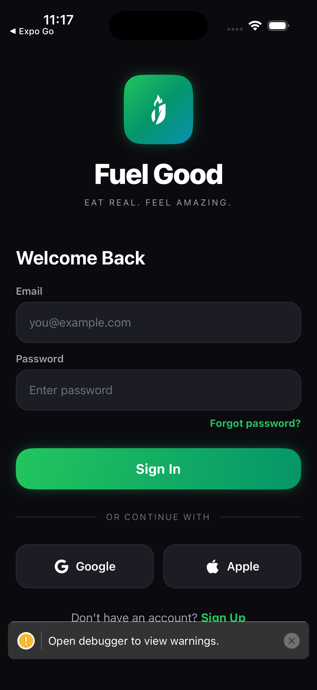 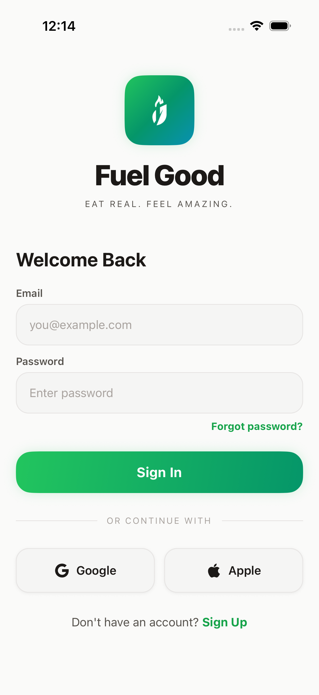

**Grade**: B+
**What works**: Strong logo treatment (green-teal gradient tile with flame), clean "Welcome Back" heading, generous spacing, Google + Apple SSO well presented as equal-weight pills. Green "Sign In" button has a subtle glow in dark mode that feels premium.
**What's subpar**:
- "Don't have an account? Sign Up" is one continuous string with no visual separation — "Sign Up" is green but the tap target is ambiguous.
- Field placeholders ("you@example.com", "Enter password") are lower contrast than ideal (~3.5:1 on dark). Bump to `textTertiary` → `textSecondary`.
- In light mode the fields have no visible elevation — they just look like empty outlined boxes. Add a subtle inner shadow or stronger border.
- "OR CONTINUE WITH" is small caps in a faded grey — fine, but the divider lines are very thin. Thicken or lean into negative space.
- "Forgot password?" is right-aligned green text immediately under the password field — on small devices it's *very* close to the password field tap target. Space it out.

**Recommendations**:
- Split "Don't have an account?" and "Sign Up" into two runs with an underline on "Sign Up".
- Add a `contentContainerStyle` with stronger safe-area padding at top — logo sits a little too close to notch.
- Light mode: add `shadowColor` to input containers with soft opacity.

**Priority**: High (it's the first screen every user sees)

#### Forgot password — `app/(auth)/forgot-password.tsx`
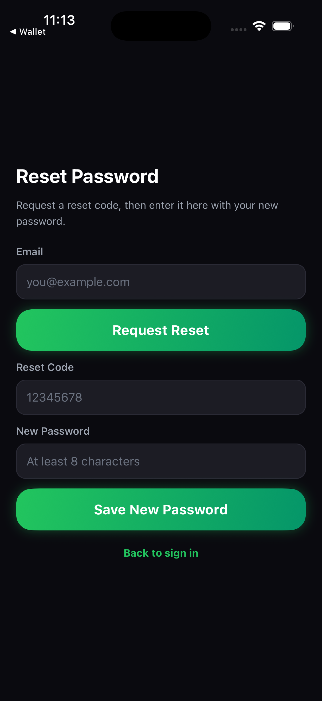 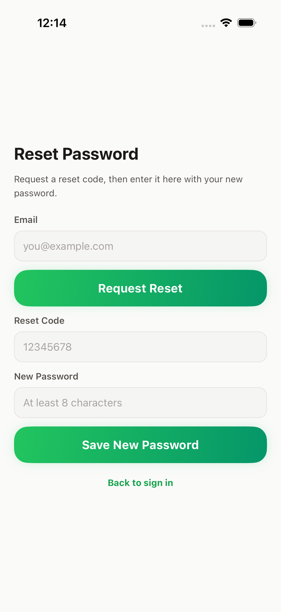

**Grade**: C+
**What works**: Clear two-step flow (Request code → Save new password) on one screen with clear labels. "Back to sign in" link is obvious.
**What's subpar**:
- No back-arrow button in header — user has to scroll to find the text link. Add a back button.
- Two primary-style buttons ("Request Reset" and "Save New Password") stacked without visual separation or disabled-until-valid styling — both look equally tappable even when the second isn't actionable yet. Either (a) disable "Save" until email is validated and code received, or (b) split into two screens.
- "Back to sign in" is a tertiary text link — should be same colour as primary brand green for discoverability.

**Recommendations**:
- Split into two steps with a progress dot indicator.
- Use the disabled button style from `components/Button.tsx` for "Save New Password" until a reset code exists.

**Priority**: Medium

#### Sign Up — `app/(auth)/login.tsx` (toggle mode)
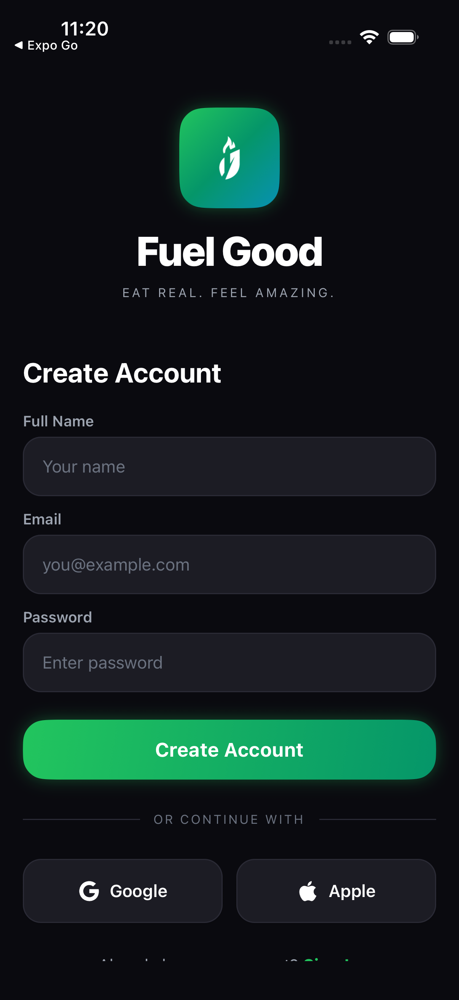 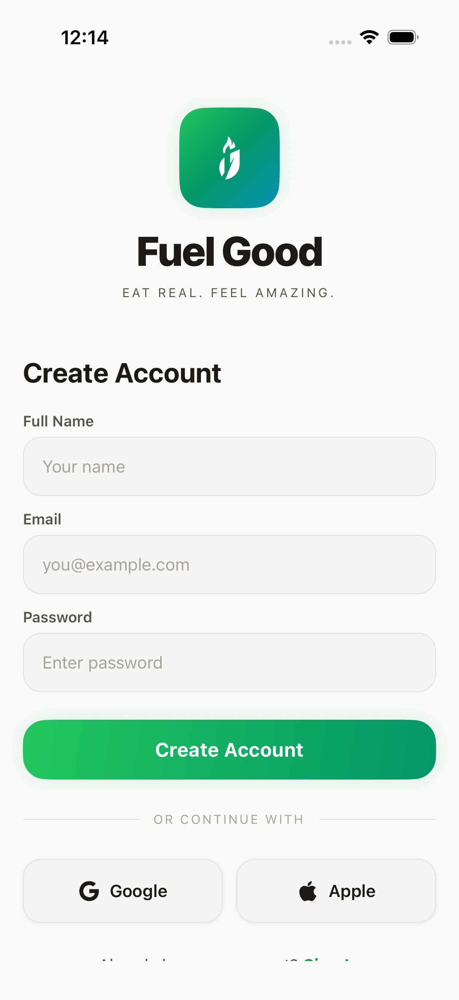

**Grade**: B
**What works**: Mirrors Login structure perfectly — same logo, same SSO placement, just swaps field layout. "Already have an account? Sign In" mirrors login copy symmetrically.
**What's subpar**:
- During my automated signup, the password field was *very hard* to focus consistently — suggesting the `TextInput` may not be wrapped in proper `inputAccessoryView` / return-key handling. When I tapped "Enter password", focus stayed on Email. This is a real keyboard-tab-order bug.
- No password strength indicator, no confirmation field, no "reveal password" toggle. For an app with a paywall behind it, this is under-built.
- Green "Create Account" button has a bright glow that conflicts with the "Sign In" button's glow on Login — if both screens use the same button component, the glow animation appears inconsistently.

**Recommendations**:
- Add `returnKeyType="next"` on Name and Email fields, `returnKeyType="done"` on Password; wire up `onSubmitEditing` to focus next field or submit.
- Add a password-visibility toggle (`secureTextEntry` + eye icon).
- Consider adding a minimum-8-characters live validator; right now the "Password must be at least 8 characters" error only surfaces after tapping Submit.

**Priority**: High

---

### Onboarding-v2 flow

#### 01 — Hook screen ("You already know something is off") — `app/onboarding-v2/video-hook.tsx`
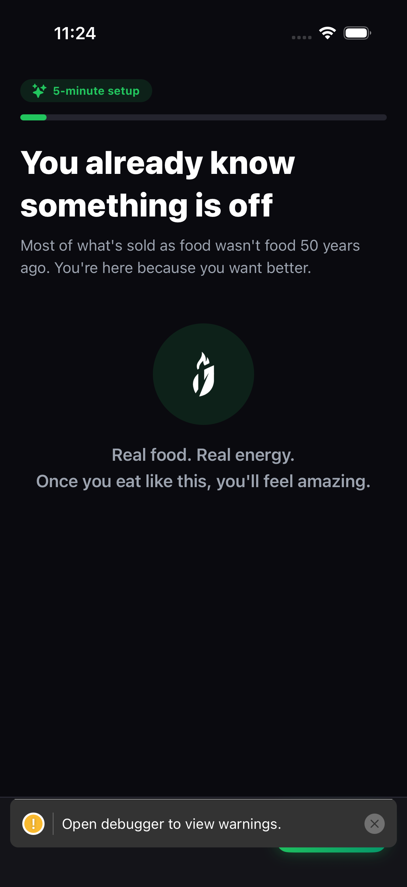

**Grade**: A-
**What works**: Phenomenally strong opening. The "5-minute setup" pill gives expected-duration reassurance. Typography ladder (display title → subhead → brand block with tagline) is textbook. Emotional copy ("Your body cares more about the presence of the good…") is on-message.
**What's subpar**:
- The "5-minute setup" pill and progress bar below it feel like two separate components. Unify into one `OnboardingHeader`.
- Circular logo mark in centre feels a bit small for the vertical real estate — could breathe more.
- "Continue" button is bottom-right, not bottom-center. In every *other* onboarding screen that had both Back and Continue, they were left/right. The hook screen has no Back, so Continue should probably center-align for primary-action clarity.

**Priority**: Low

#### 02 — "What brought you here?" — `app/onboarding-v2/goal-context.tsx`
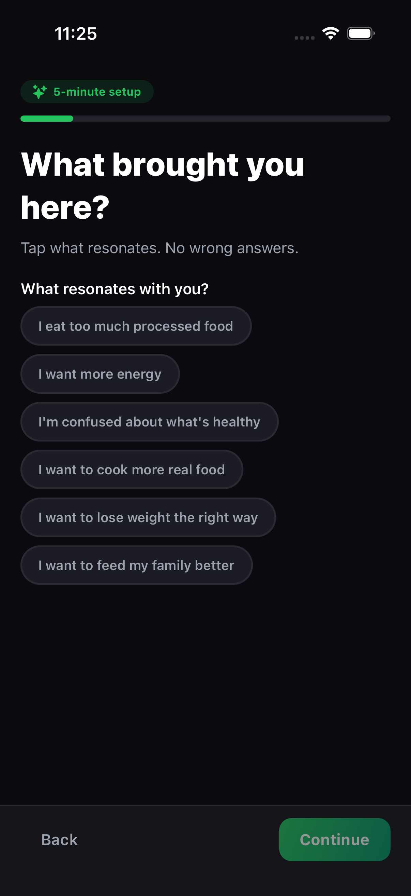

**Grade**: A-
**What works**: Multi-select chip grid is well-spaced, copy is empathetic ("No wrong answers"), vertical rhythm is nice.
**What's subpar**:
- Chips have very low contrast when unselected — they're a dark-grey on a near-black background (~2.8:1). User can't easily see all 6 options at a glance.
- No visual feedback on how many need to be selected — Continue sat disabled until I tapped 2, but there's no "Pick 1-3" copy.
- On multiselect, selected chips should animate (scale or glow) — they just change border colour, which is subtle.

**Priority**: Medium

#### 03 — "How often do you eat ultra-processed food?" — `app/onboarding-v2/diet-history.tsx`
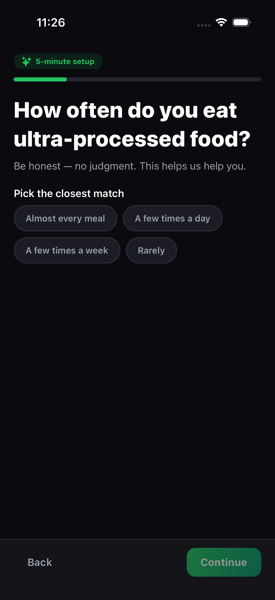

**Grade**: B+
**What works**: 2×2 grid of chips is balanced. "Be honest — no judgment" is perfect tone.
**What's subpar**: Same chip-contrast issue as above. Also "Pick the closest match" is a sub-sub-header that could just be the field prompt.

**Priority**: Low

#### 04 — Snapshot reveal — `app/onboarding-v2/goal-context.tsx` result view
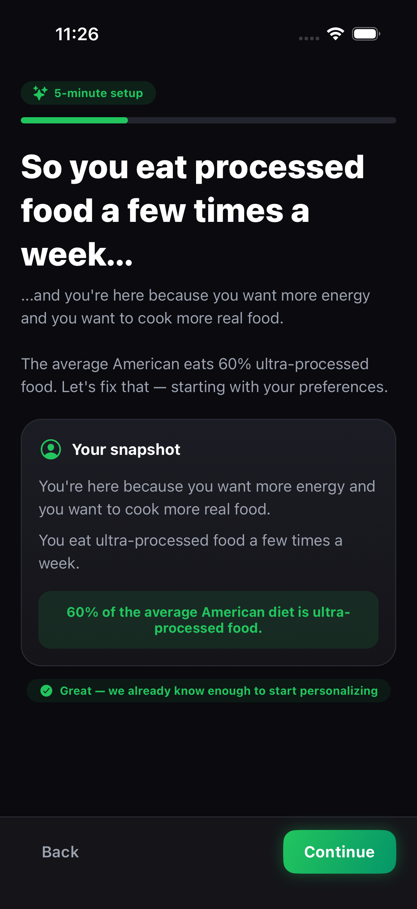

**Grade**: A
**What works**: Best screen in onboarding. "So you eat processed food a few times a week…" is the user's own answer mirrored back with a statistic ("60% of the average American diet is ultra-processed") and a reassuring green check ("Great — we already know enough to start personalizing"). This is chef's-kiss nutrition coaching.
**What's subpar**: The "Your snapshot" card inside has a thinner border than the "60% of the average American…" call-out card — visual hierarchy is slightly inverted.

**Priority**: Low

#### 05 — Fuel Score reveal (85 / Day of mostly whole foods) — `app/onboarding-v2/meal-reveal.tsx`
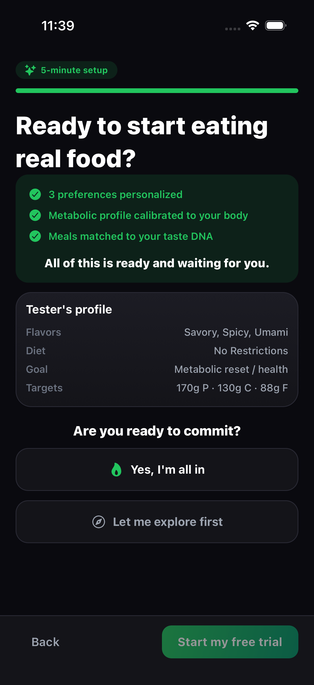

**Grade**: A-
**What works**: The ring is *the* visual icon of the app. Showing it at 85 for "mostly whole foods" is a perfect preview. "We measure food quality with a Fuel Score. Eat whole foods, score high. It's that simple." is the perfect one-liner.
**What's subpar**:
- The ring doesn't animate from 0→85 on mount. That animation is the single biggest "wow" moment available. **Fix this.**
- Subtitle "Your body cares more about the good you put **IN** than the bad you try to cut out" — the `**IN**` bold text emphasis is nice but the inline bold is a different weight from the display headline, looks like a text-styling bug. Render it as a coloured phrase instead.

**Priority**: High (motion fix)

#### 06 — Flex meals explanation — `app/onboarding-v2/energy-check.tsx`
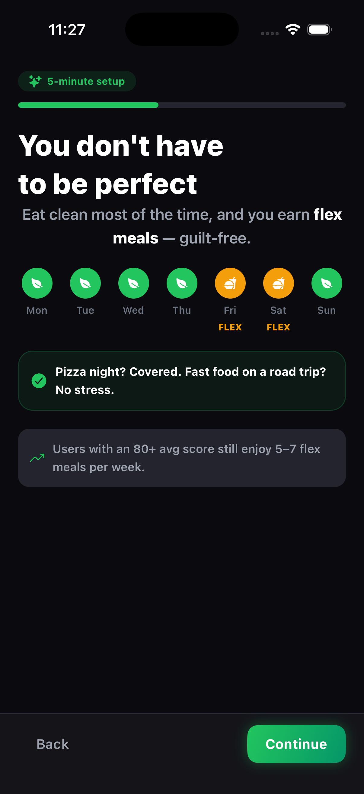

**Grade**: A
**What works**: 7-day leaf/flex ticket row (Mon green → Sun green, Fri/Sat gold flex) is *exactly* the visualization the README describes. "Pizza night? Covered. Fast food on a road trip? No stress." is the reward-psychology pitch in one sentence.
**What's subpar**:
- The leaf icons aren't quite uniform size — Sun's leaf looks slightly smaller than Mon.
- "Users with an 80+ avg score still enjoy 5-7 flex meals per week" could be elevated as a proof-point stat rather than subtext.

**Priority**: Low

#### 07 — Flavor preferences — `app/onboarding-v2/diet-history.tsx`
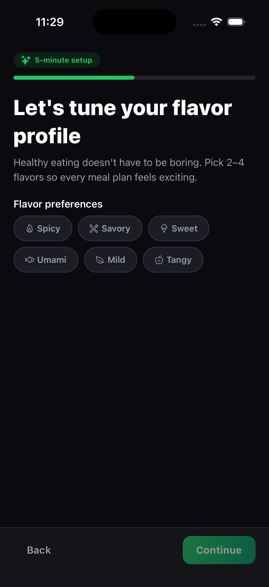

**Grade**: B
**What works**: Chips with icons (flame for spicy, fork for savory, sparkle for umami, etc.) — nice texture.
**What's subpar**:
- 6 chips in 2 rows of 3 leaves a lot of empty space below. Either (a) add more options, (b) make each chip larger/more detailed, or (c) add descriptive examples underneath the section prompt.
- Icons are slightly inconsistent style (some filled, some outlined).

**Priority**: Medium

#### 08 — Dietary preferences + allergies — `app/onboarding-v2/mirror.tsx`
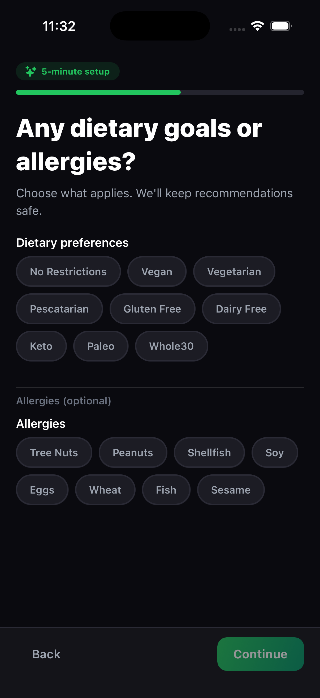

**Grade**: C+
**What works**: Two-column layout with "Dietary preferences" and "Allergies (optional)" clearly grouped.
**What's subpar**:
- Feels dense and clinical compared to the emotional warmth of screens 1-6. User goes from "we know you" storytelling to 20+ selectable chips.
- "Allergies" section header gets almost-same visual weight as "Dietary preferences" — but one is required (well, "No Restrictions" is a valid choice) and the other is optional. Demote the allergies section visually.
- No way to tell from the visuals which allergies are the "common 9" — a subtle "common allergens" grouping would help.

**Recommendations**: Split dietary and allergies into separate steps (already 15 steps, 16 won't hurt) to reduce cognitive load.

**Priority**: Medium

#### 09 — Protein + ingredient preferences — `app/onboarding-v2/mirror.tsx`
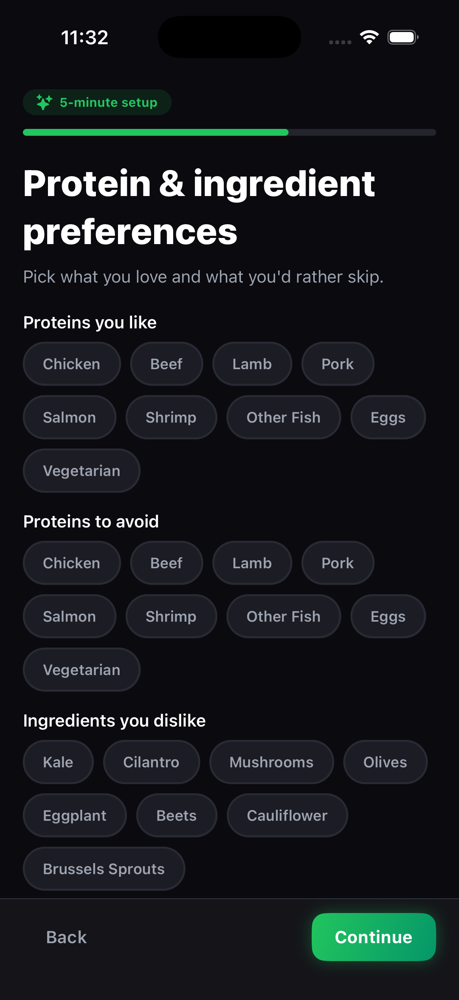

**Grade**: C
**What works**: Three sections clearly labeled.
**What's subpar**:
- **"Proteins you like" and "Proteins to avoid" show the SAME list of 9 chips** — user can hypothetically select "Chicken" in both. This is confusing and needs a clearer "you like / you avoid / you don't care" taxonomy (e.g., three-state chips: default, liked, avoided).
- Three stacked chip-grids with ~30 total options on one screen is the densest information screen in onboarding. Way too much.
- "Ingredients you dislike" is a flat list of 7 — could benefit from category grouping (Greens, Alliums, etc.).

**Recommendations**: Collapse the two protein lists into one with tri-state chips, or split into two screens.

**Priority**: High

#### 10-11 — Body metrics (Weight, Height, Age, Sex, Activity) — `app/onboarding-v2/mirror.tsx`
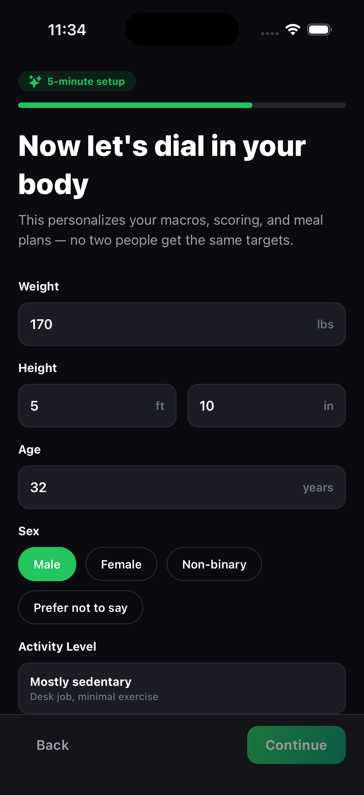 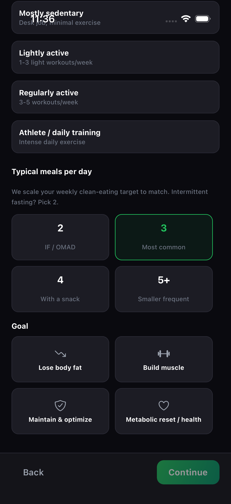

**Grade**: B-
**What works**: Inclusive sex options (Male / Female / Non-binary / Prefer not to say). Activity level options have secondary descriptions ("Desk job, minimal exercise").
**What's subpar**:
- Scrolled view shows **Dynamic Island overlap with "Mostly sedentary" label** — content bleeds under the notch. Real bug.
- 6 fields + activity level + meals-per-day + goal = 9 required inputs on one screen. Split into at least 2 screens.
- Unit labels ("lbs", "ft", "in", "years") are tiny right-aligned suffix text. Could be an inline chip.
- Height uses two fields (5 / 10) that look identical — ft and in labels are easy to confuse. Consider a single picker ("5'10\"").
- "Typical meals per day" is buried mid-screen; should have its own slide with explanatory copy about IF.
- "Goal" chips (Lose body fat / Build muscle / Maintain & optimize / Metabolic reset / health) are 2×2 with icons — nice, but "Metabolic reset / health" wraps awkwardly.

**Recommendations**:
1. Add `SafeAreaView edges={['top']}` to the scroll container.
2. Split into 3 pages: Body stats / Activity + meals / Goal.

**Priority**: High (safe-area bug is Critical for App Store review)

#### 12 — Anything else (Body fat, Metabolic health) — `app/onboarding-v2/mirror.tsx`
 

**Grade**: A-
**What works**: Correctly framed as "Optional — skip if unsure". Toggle rows for insulin resistance / prediabetes / Type 2 diabetes are clear. "Self-reported — used only to personalize scoring. Not medical advice." disclaimer is responsible.
**What's subpar**:
- Body Fat % shows "18" as a placeholder? Or is that the default? Looks filled. Clarify empty state.
- Toggle switches use the iOS system switch, which looks dated in this otherwise-custom UI. Consider a custom branded toggle.

**Priority**: Low

#### 13 — Personalised targets — `app/onboarding-v2/generating-plan.tsx`
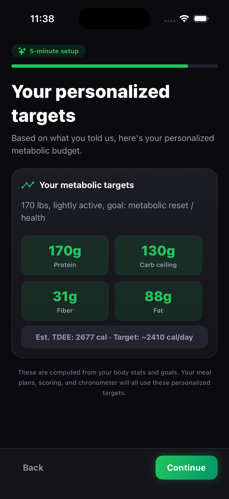

**Grade**: A
**What works**: 2×2 macro grid (170g protein / 130g carb ceiling / 31g fiber / 88g fat) is dense but readable. "170 lbs, lightly active, goal: metabolic reset / health" context header ties the numbers to the user. "Est. TDEE: 2677 cal · Target: ~2410 cal/day" in a pill is a nice power-user detail.
**What's subpar**:
- All 4 macro values use the same green — would be more glanceable if each macro had its own hue (ProteinColors / CarbColors / FatColors already exist in `constants/Colors.ts`).
- The card has no entrance animation — this is a reveal moment, it should feel ceremonial.

**Priority**: Medium

#### 14 — Plan preview ("Here's what a great day looks like for you") — `app/onboarding-v2/plan-preview.tsx`
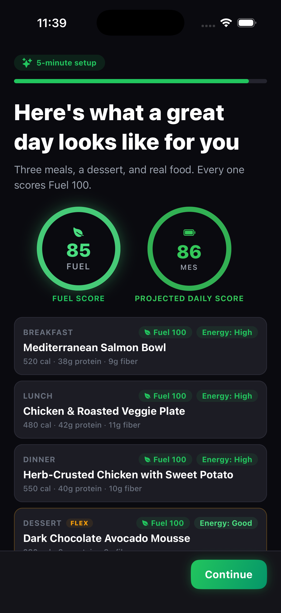

**Grade**: A+
**What works**: Standout screen. Two hero rings (Fuel 85 / MES 86) side-by-side, then 4 meal cards (Breakfast / Lunch / Dinner / Dessert) each with "Fuel 100" and "Energy: High" tags. Dessert card shows "FLEX" and "Good" for the energy tag — subtle demonstration of the flex concept. This is the "Damn, I want this app" screen.
**What's subpar**:
- Scroll performance not tested but with 4 cards + two rings + heading, it may feel heavy without virtualisation.
- "Fuel 100" badge colour (green) and "Energy: High" tag colour (green) are visually the same — they're measuring different things. Differentiate.
- No recipe photos! This is the ONE screen where food photography would sell the plan. Currently it's all text. **Biggest missed opportunity in the audit.**

**Priority**: High (add food imagery to meal cards)

#### 15 — Commitment — `app/onboarding-v2/commitment.tsx`
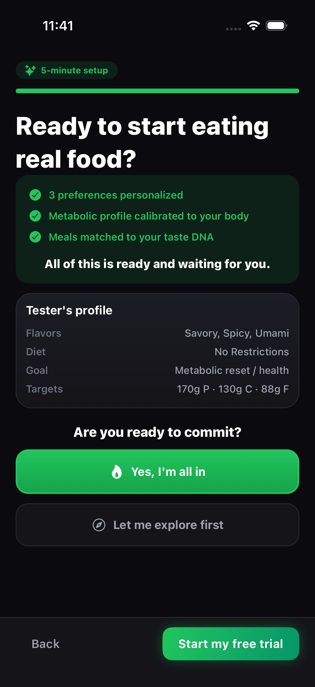

**Grade**: A-
**What works**: Checklist ("3 preferences personalized / Metabolic profile calibrated / Meals matched to your taste DNA") is a nice progress recap. "Tester's profile" summary card with all their choices creates a contract-like feeling. Two-option commit CTA ("Yes, I'm all in" / "Let me explore first") is a smart emotional gate before paywall.
**What's subpar**:
- "Tester's profile" uses the user's first name — good, but the profile card is inside another card which is inside a scroll view — 2-3 levels of nesting visible.
- "Start my free trial" is bottom-right — should be full-width primary CTA.
- No visible price anchor before the free trial — users commit without knowing what they're committing to yet.

**Priority**: High (CTA placement + price transparency)

#### Paywall — expected on `onboarding-v2/paywall.tsx`
**NOT CAPTURED** — the test account was granted Premium automatically (likely via RevenueCat sandbox dev bypass), so "Premium Active / OK" dialog appeared instead of the paywall. ([02-onb-17-premium-granted](ui-audit/screenshots/dark/02-onb-17-premium-granted.png))

**Recommendation**: Please run a second audit pass with a sandbox account that doesn't auto-grant premium, OR capture the paywall screen via developer menu. This is the single highest-ROI screen in the app to get right.

**Priority**: High — schedule a follow-up paywall-specific audit.

---

### Home tab

#### 10 — Home dashboard — `app/(tabs)/(home)/index.tsx`
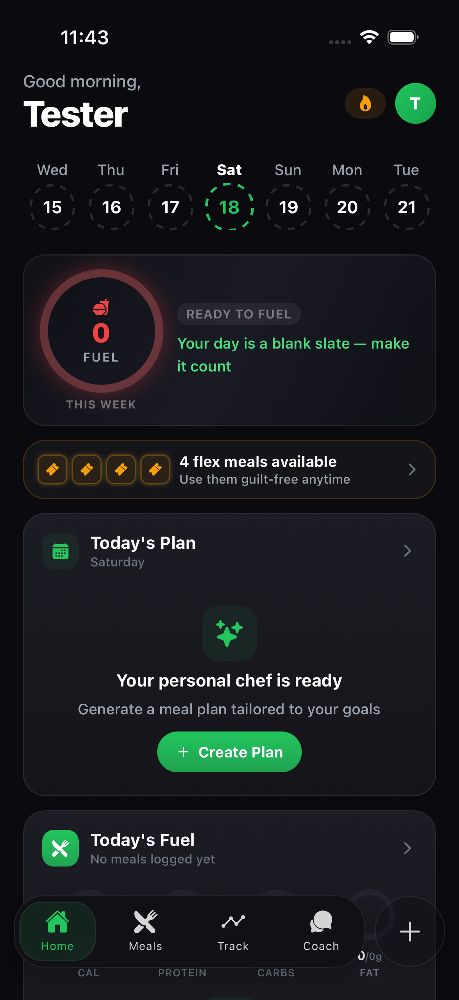 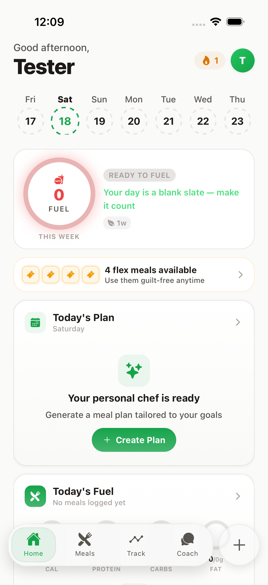

**Grade**: C+ (because of the red ring issue; otherwise B+)
**What works**:
- "Good morning, Tester" greeting — time-aware, warm.
- 7-day date picker row with today circled is clean.
- "Ready to Fuel" copy ("Your day is a blank slate — make it count") is brand-perfect.
- 4 amber flex tickets under "4 flex meals available / Use them guilt-free anytime" is tactile.
- "Today's Plan / Your personal chef is ready / Create Plan" CTA is clear and inviting.
- Orange flame icon + "1" in top-right for streak is a good persistent motivator.

**What's subpar**:
- **The "0 FUEL" ring is RED.** Nowhere in the README does it suggest an empty day should feel like a red alert. Fix this — use the neutral or a muted primary tone.
- "THIS WEEK" label is all-caps grey — slightly disconnected from the ring visually.
- Below the ring area (when scrolled) lives a macro pill showing CAL / PROTEIN / CARBS / FAT with "0g" values — empty state is barely distinguishable from loading.
- Tab bar *floats* with a + button isolated on the right; doesn't match other tabs' style.
- "Today's Fuel / No meals logged yet" card has an X icon in green — green checkmark would feel more inviting than an X for "empty".

**Recommendations**:
- Change empty Fuel ring to `ScoreColors.neutral` or a soft gradient.
- Animate ring entrance and any value changes.
- Unify tab bar styling with other tabs.

**Priority**: Critical (the red ring)

#### Home dashboard, scrolled — same file
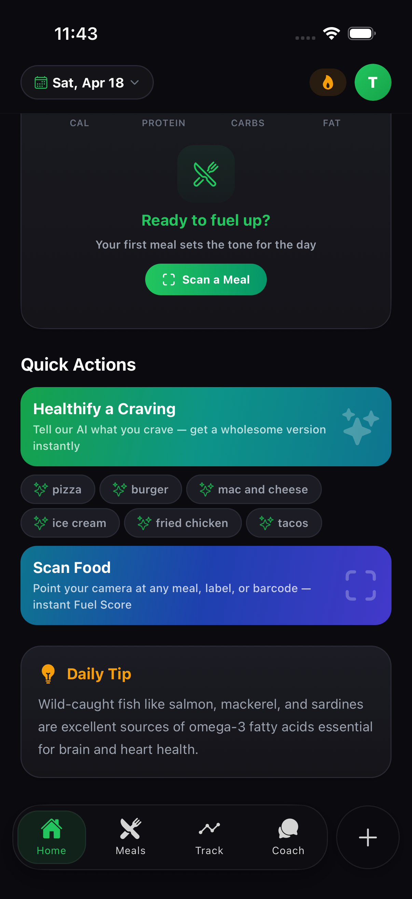 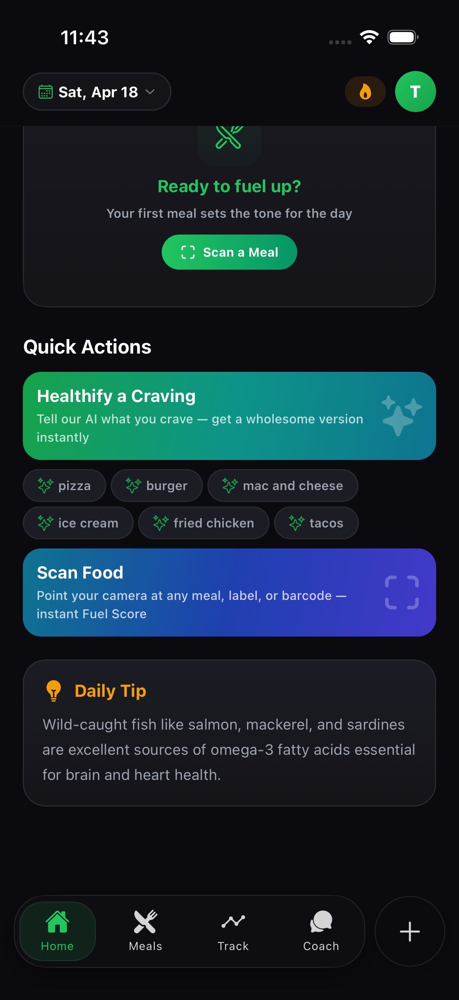 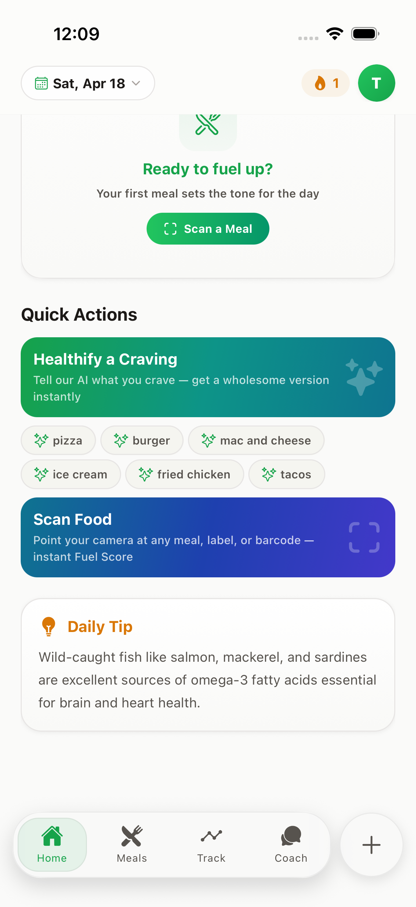

**Grade**: B+
**What works**:
- "Ready to fuel up? Your first meal sets the tone for the day" + "Scan a Meal" CTA is good.
- "Quick Actions" section with **Healthify a Craving** (gradient card with "pizza / burger / mac and cheese / ice cream / fried chicken / tacos" chips) and **Scan Food** (purple gradient card) are the most visually interesting cards in the app. Chef's kiss.
- Daily Tip ("Wild-caught fish like salmon…") lightbulb icon card is a nice passive educational layer.

**What's subpar**:
- The "Healthify" chips are quite small and all near-identical pill shape — could lean into the "guilty pleasure" emotional copy more (e.g., "🍕 pizza tonight?").
- Scan Food gradient card competes visually with Healthify card — two vibrant gradients stacked make the section feel loud.
- No Today's Plan meal cards shown once plan is generated — audit didn't reach that state, but the empty "Create Plan" state persists too long.

**Priority**: Medium

#### Weekly Fuel breakdown — `app/(tabs)/(home)/fuel-weekly.tsx`
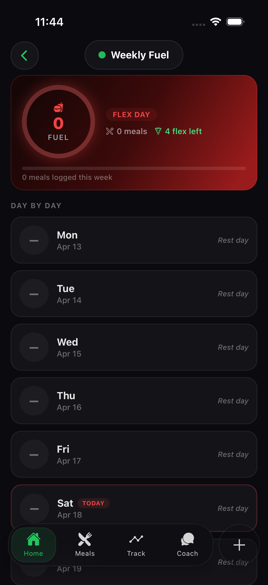

**Grade**: B
**What works**: Top hero card with the same 0 FUEL ring + "FLEX DAY / 0 meals / 4 flex left" triple stat is a good week-summary. "0 meals logged this week" subtitle with a progress line is scannable. Day-by-day list (Mon-Sun) with "Rest day" tags for empty days is clear.
**What's subpar**:
- **Same red 0 FUEL ring issue.** Here it's even more dominant — the whole top card is red-accented.
- "FLEX DAY" pill in bright orange on red card creates a 3-colour-accent collision (green chevron + orange pill + red ring).
- "Rest day" appears on every day — would be clearer as "Not logged" or "No data yet" since "rest day" implies a workout context.
- No way to tap a day and see its detail from here (I tested — no nav change).

**Priority**: High

#### Flex Budget — `app/(tabs)/(home)/flex.tsx`
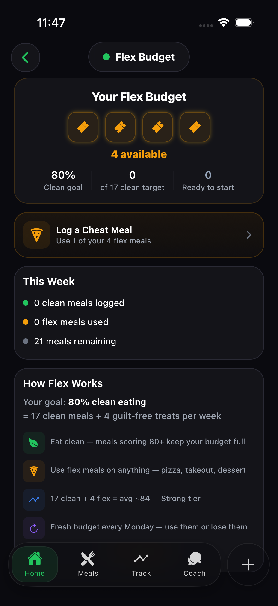 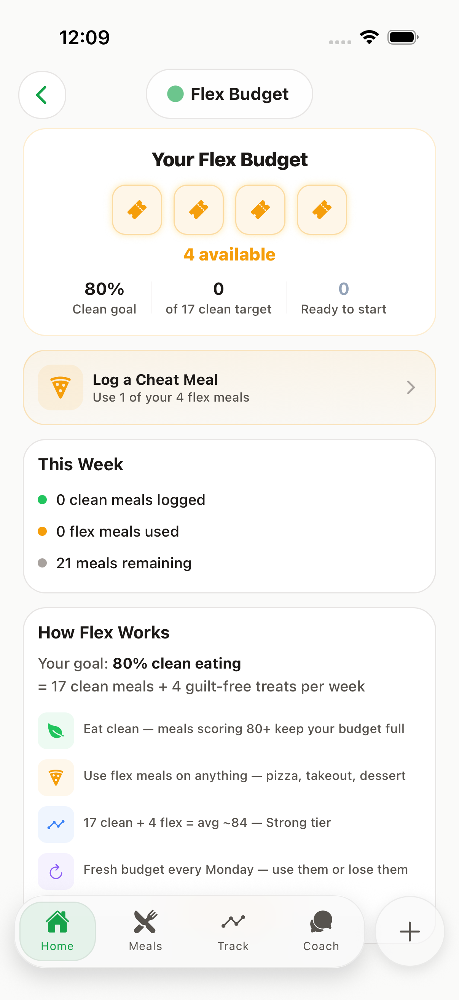 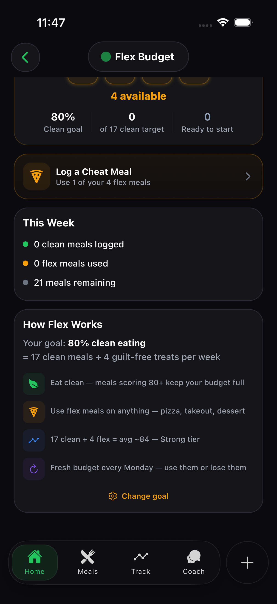

**Grade**: A-
**What works**:
- Top card "Your Flex Budget" with 4 amber tickets + "4 available" + 3-stat row (80% / 0 of 17 / 0 ready to start) is dense but readable.
- "Log a Cheat Meal / Use 1 of your 4 flex meals" row with pizza icon is clever.
- "This Week" card with dot-indicators (green / yellow / grey).
- "How Flex Works" section with 4 explanatory rows is good user education.

**What's subpar**:
- The "0 clean meals logged / 0 flex meals used / 21 meals remaining" stat line is essentially empty-state noise; could be a single "Start logging to see your progress" CTA instead.
- "Change goal" link is tiny gear + text at the bottom — should be a more prominent edit affordance.
- Light mode: the amber flex tickets lose a lot of their glow — they look like yellow stickers rather than coins.

**Priority**: Medium

#### Meal Plan Builder modal — `app/meal-plan-builder.tsx`
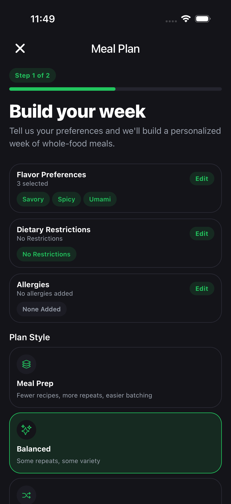 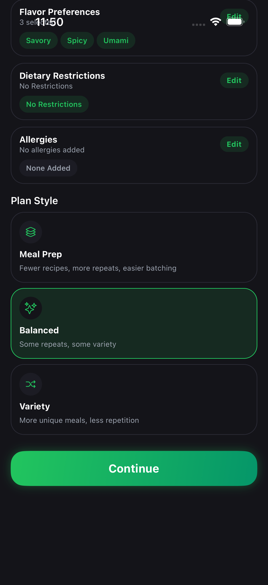 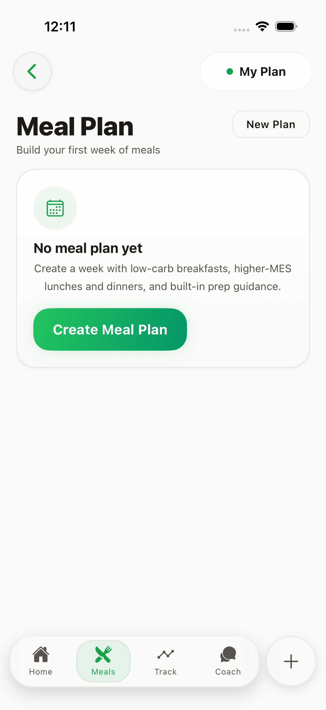

**Grade**: B
**What works**: "Step 1 of 2" progress bar is clear. "Build your week" title + "Tell us your preferences" copy is on-message. Shows previously-selected Flavour Preferences / Dietary Restrictions / Allergies with "Edit" pills — nice carry-forward.
**What's subpar**:
- On the Meals→My Plan empty state ([20-meals-01-myplan-empty](ui-audit/screenshots/dark/20-meals-01-myplan-empty.png)), the "Create Meal Plan" CTA is great, but once you tap it, the modal title becomes "Meal Plan / Build your week" — *three different phrases* for the same feature ("Create Plan", "Create Meal Plan", "Build your week"). Pick one.
- "Plan Style" selector with "Meal Prep / Balanced / …" is visible but the Balanced option already appears selected (green outline). Is that a default or current state? Clarify.
- Two-step flow is hidden behind a scroll — users may not realise there's a step 2.

**Priority**: Medium

---

### Meals tab

#### Meals Hub — `app/(tabs)/meals/index.tsx`
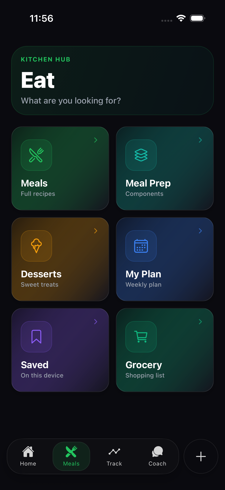 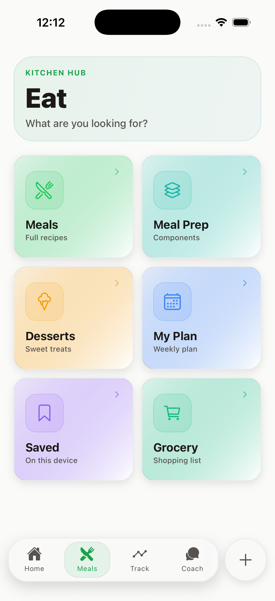

**Grade**: A
**What works**: Best navigation hub in the app. 2×3 grid of coloured gradient cards (Meals/green, Meal Prep/teal, Desserts/orange, My Plan/blue, Saved/purple, Grocery/green) with icons + title + subtitle. "KITCHEN HUB / Eat / What are you looking for?" header sets a confident tone.
**What's subpar**:
- 6 different gradient colours with no semantic grouping — feels a little arbitrary. Consider semantic grouping: food discovery (green shades) vs planning tools (blue/purple) vs shopping (orange).
- The small chevron arrows in each card's top-right are redundant with the card being obviously tappable.

**Priority**: Low

#### Browse Recipes (Full Meals / Meal Prep / Desserts) — `app/(tabs)/meals/browse.tsx`
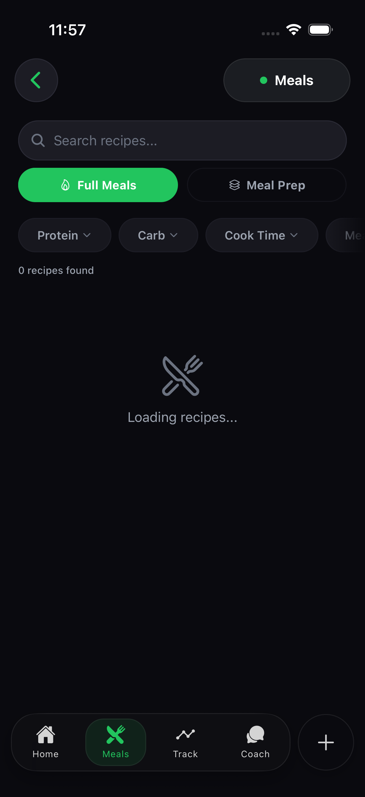 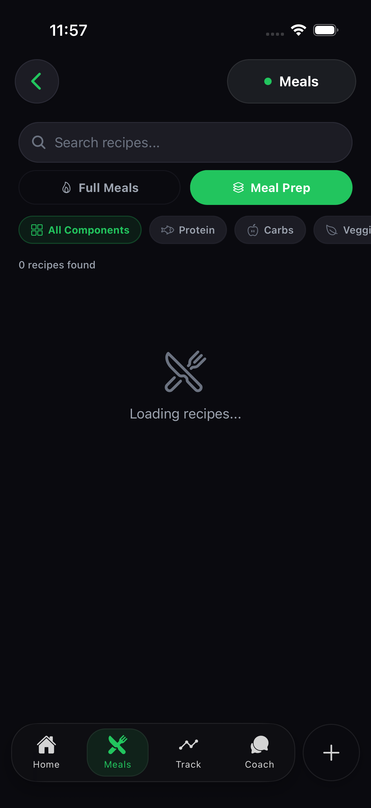 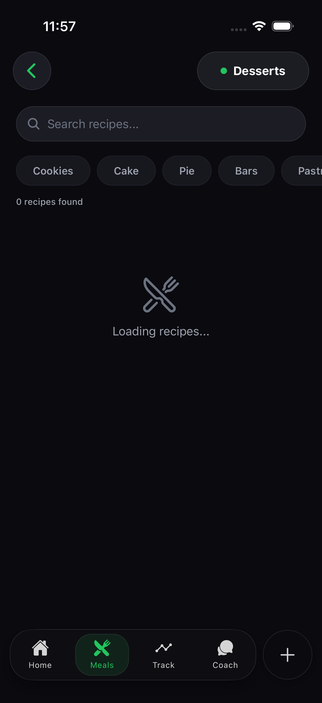 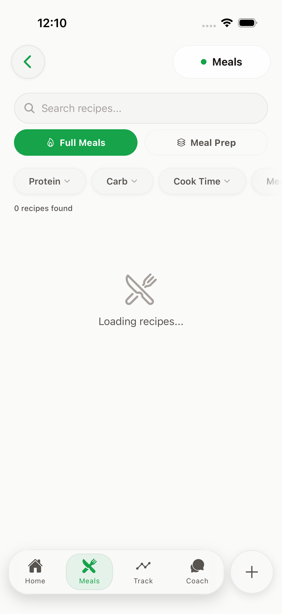

**Grade**: D+ (empty state is broken, not just sparse)
**What works**: Top header with back arrow + contextual pill ("Meals" / "Desserts"). Search bar. Filter chip row (Protein / Carb / Cook Time / …). Tab toggle ("Full Meals / Meal Prep").
**What's subpar**:
- **"0 recipes found" followed by "Loading recipes…"** indefinitely. This is a data-fetch bug in the test environment but the UI has no loading-timeout fallback ("Can't load? Pull to retry").
- Dessert category chips truncate visibly ("Pastr…"). Filter row needs `ScrollView horizontal` with better overflow handling.
- Protein / Carb / Cook Time dropdown chips show caret-down but no visual treatment for "active filter" — user won't know what they've selected at a glance.
- **No recipe imagery visible anywhere**. For a food-discovery surface, this is a major gap. Even placeholder photos would be better than none.

**Priority**: Critical (recipe browse is a core flow and currently broken)

#### Saved Recipes — `app/(tabs)/meals/saved.tsx`
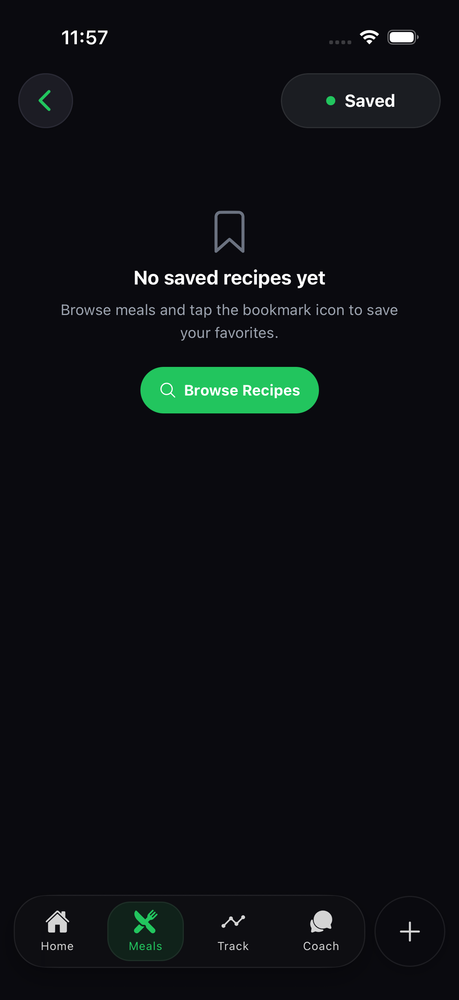

**Grade**: A-
**What works**: Clean empty-state with bookmark icon, "No saved recipes yet", actionable "Browse Recipes" button, and helpful copy ("Browse meals and tap the bookmark icon to save your favorites").
**What's subpar**: Nothing glaring at the empty state. Would be worth re-auditing once populated.

**Priority**: Low

#### Grocery List — `app/(tabs)/meals/index.tsx` Grocery section
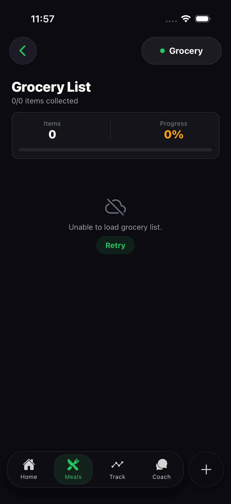

**Grade**: D
**What works**: Top stat card with Items count + Progress bar is a decent planning affordance.
**What's subpar**:
- **"Unable to load grocery list / Retry"** is the entire empty state. This is an error state dressed up as normal state — gives the impression the app is broken.
- Should instead say "Your grocery list will build as you add meals to your plan" with a link to create a plan.
- The error is probably because no plan exists → the component should pre-empt that case with a proper first-run empty state, not crash into the network error state.

**Priority**: High

---

### Track tab

#### Track Dashboard — `app/(tabs)/chronometer/index.tsx`
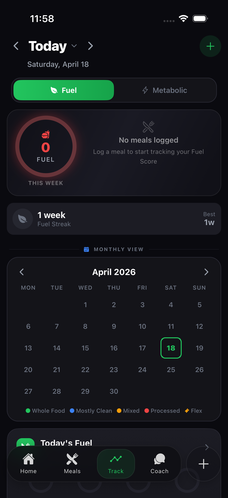 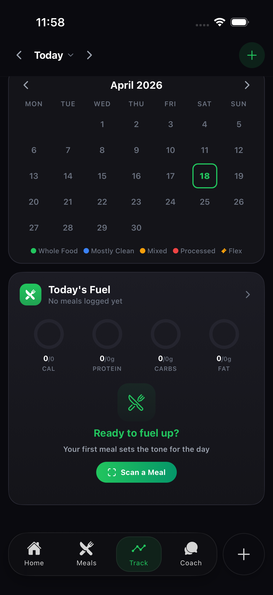 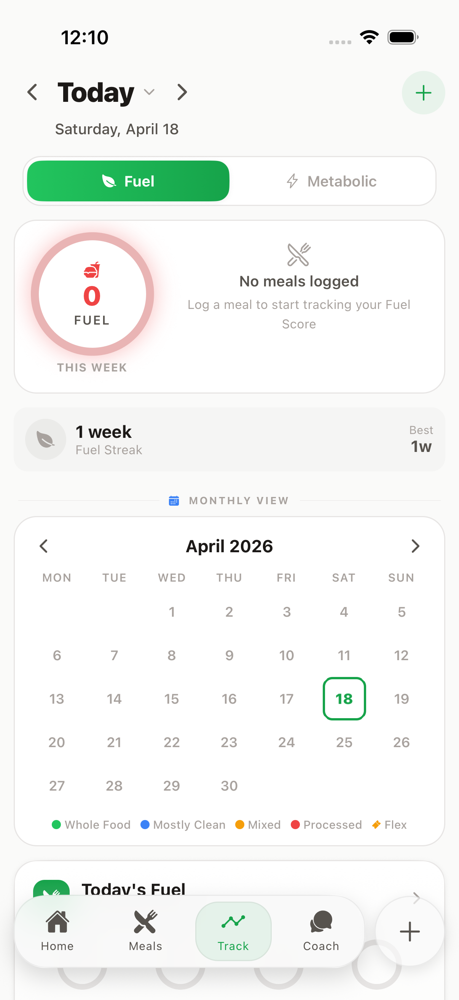

**Grade**: B-
**What works**:
- "Today / Saturday, April 18" with < > navigation at top — classic Chronometer-style.
- Tab toggle "Fuel / Metabolic" groups two views under one tab — smart.
- "0 FUEL" ring + "No meals logged / Log a meal to start tracking your Fuel Score" empty state is clear.
- Monthly calendar heat-map with colour legend ("Whole Food / Mostly Clean / Mixed / Processed / Flex") is a *great* long-term-view visualization.
- Today's Fuel card with macro rings CAL / PROTEIN / CARBS / FAT stacked makes for a clean nutrition snapshot.

**What's subpar**:
- **Same red 0 FUEL ring issue as Home.**
- "1 week Fuel Streak" badge at top with "Best 1w" right-aligned — "Best 1w" is a bit cryptic; "All-time best: 1 week" would be clearer.
- Monthly view shows April 2026 with "18" circled — but days 1-29 are in grey/white without any actual data colour. Looks like a plain calendar, not a data visualisation yet.
- "Ready to fuel up? Your first meal sets the tone for the day" + "Scan a Meal" CTA is identical to Home's. Cross-screen deduplication would help.

**Priority**: High (red ring + empty-calendar clarity)

---

### Coach tab

#### Fuel Coach chat — `app/(tabs)/chat/index.tsx`
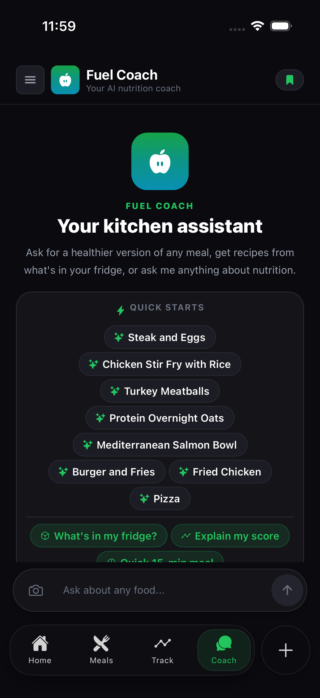 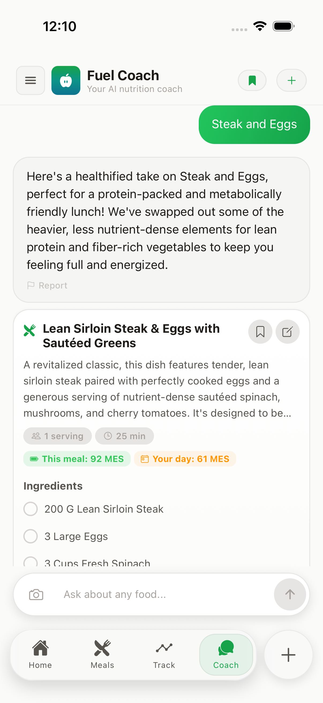

**Grade**: A
**What works**:
- The best empty state in the app. Shows "Your kitchen assistant" title + 8 quick-start pills (Steak and Eggs / Chicken Stir Fry with Rice / Turkey Meatballs / Protein Overnight Oats / Mediterranean Salmon Bowl / Burger and Fries / Fried Chicken / Pizza) + 3 prompt chips ("What's in my fridge?" / "Explain my score" / "Quick 15-min meal").
- Apple-logo mark with "FUEL COACH" sub-tag on the hero card.
- Camera icon in the input bar enables multi-modal (scan food + chat).
- Hamburger menu top-left suggests chat history drawer.

**What's subpar**:
- The mix of food-item pills (specific meals) + topic pills ("What's in my fridge?") is confusing — some are "generate a recipe" prompts, others are meta-questions. Separate into two rows with labels.
- "FUEL COACH" caps sub-label under the apple mark is styled differently from other section labels in the app.

**Priority**: Low

#### Coach response (Steak and Eggs healthified) — `app/(tabs)/chat/index.tsx`
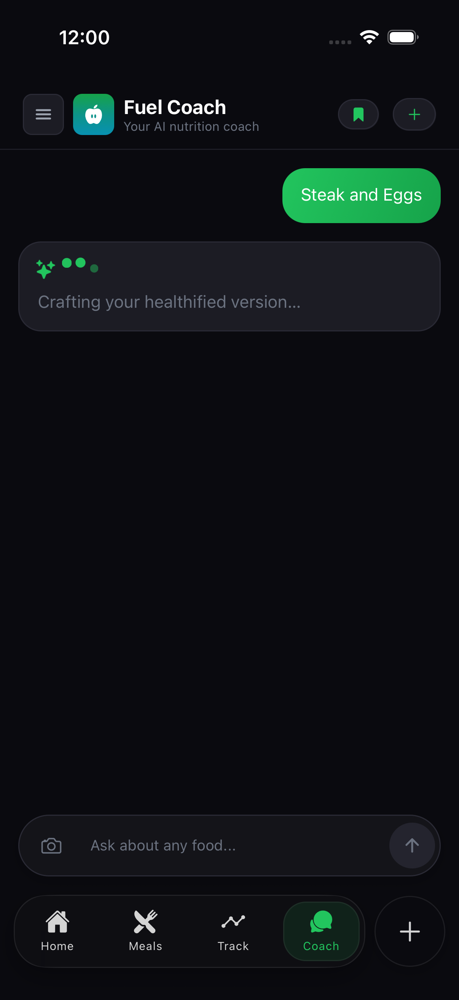 

**Grade**: A
**What works**: Recipe card rendered inline with title ("Lean Sirloin Steak & Eggs with Sautéed Greens"), description, "1 serving / 25 min" meta, "92 MES" green pill + "61 MES" orange pill (why both?), ingredient checklist preview. Feels like a magazine.
**What's subpar**:
- Two MES values shown — "This meal: 92 MES" (good) and "Your day: 61 MES" (yellow) — the contrast is meaningful but unexplained. Why two? Tooltip or legend needed.
- "Report" pill on every AI reply is heavy-handed — move to a long-press menu.
- No photo of the recipe — same issue as plan preview.
- Bookmark + edit icons top-right of the card are fine but the save-to-saved-recipes feedback is unseen.

**Priority**: Medium

#### Chat history drawer (attempted)
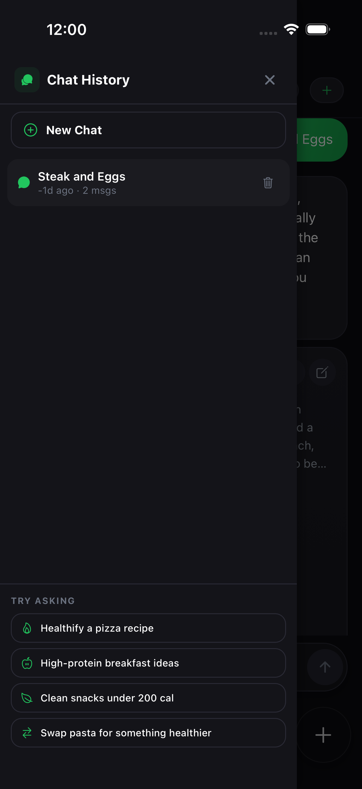 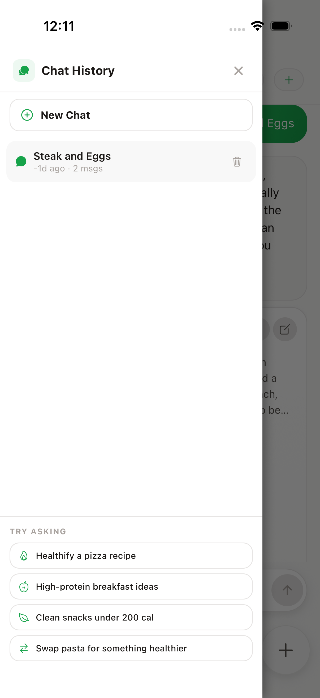

**Grade**: Insufficient data — drawer tap didn't fully open in the automation; please manually capture this state.

**Priority**: Revisit

---

### Profile tab

#### Profile Overview — `app/(tabs)/profile/index.tsx`
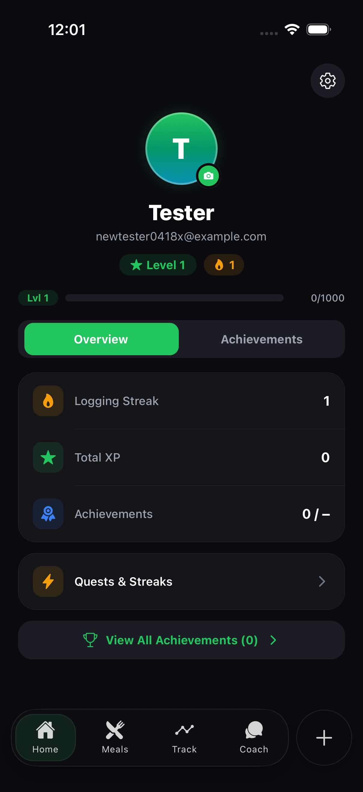 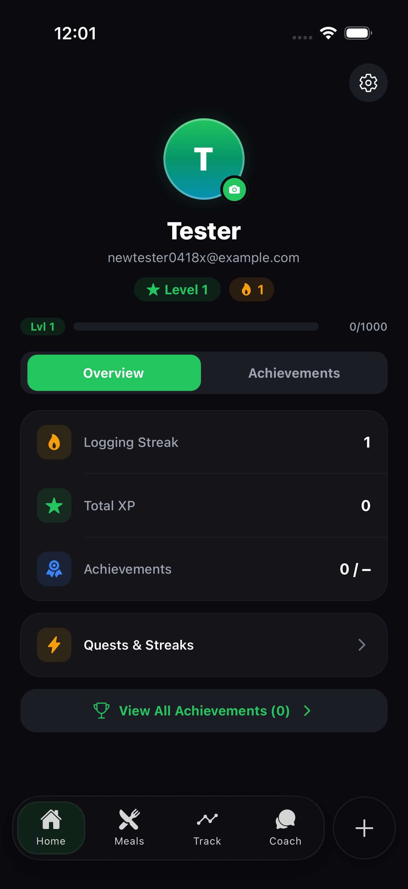 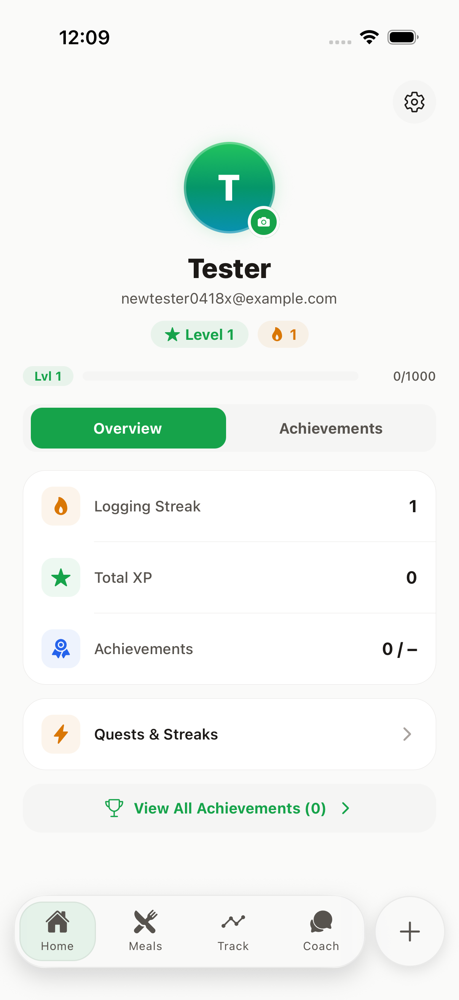

**Grade**: B
**What works**:
- Large centered avatar (circle T placeholder + green glow ring + small camera-edit badge) makes identity feel important.
- "Tester" + email + Level 1 / streak pills + "Lvl 1 [progress bar] 0/1000" XP bar establish gamification clearly.
- Tab toggle "Overview / Achievements" at top of content.
- 3 stat rows (Logging Streak / Total XP / Achievements) followed by "Quests & Streaks" button and "View All Achievements (0)" is a scannable progression UI.

**What's subpar**:
- Avatar camera-edit badge overlap the bottom-right of the circle awkwardly — it partly covers the avatar letter. Move it OFF the avatar to a clear "Edit photo" button below the name.
- Green glow ring around the avatar is a nice dark-mode effect but looks weak/artefact-y in light mode.
- "0 / –" for Achievements — the em-dash for "total" is cryptic. Should be "0 / 25" or similar concrete total.
- The level progress bar is a bit thin and easy to miss.
- No direct link from here to "Dietary Preferences" / "Flavor Profile" / other profile data — user has to go through Settings to edit them.

**Priority**: Medium

#### Settings — `app/(tabs)/profile/settings.tsx`
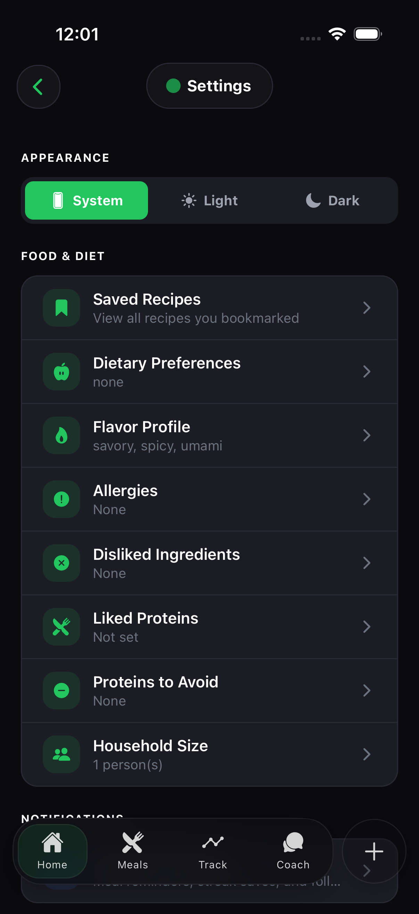 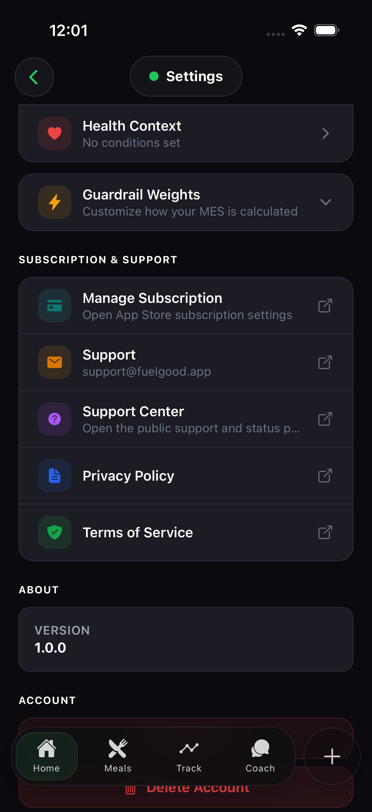 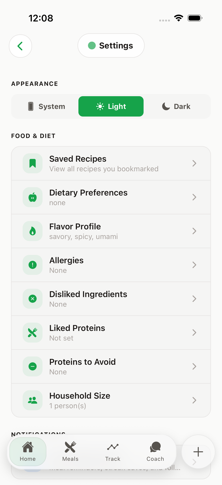 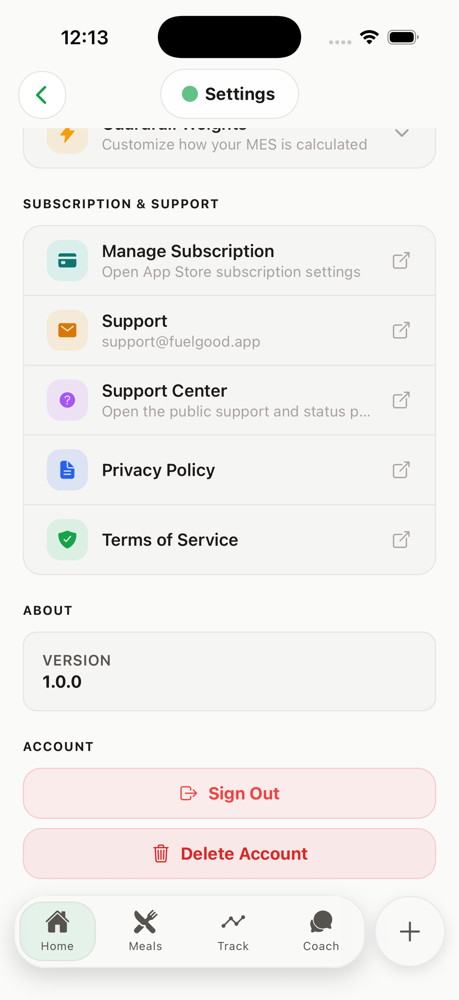

**Grade**: A-
**What works**:
- Appearance toggle (System / Light / Dark) with icons is textbook.
- Clear sections: APPEARANCE / FOOD & DIET / NOTIFICATIONS / SUBSCRIPTION & SUPPORT / ABOUT / ACCOUNT — responsible hierarchy.
- Colourful leading icons for each row.
- "Manage Subscription" links out to App Store (external-link icon) — correct.
- "Delete Account" in red at the bottom — standard destructive action placement.
- "Privacy Policy" and "Terms of Service" both present with external-link icons.

**What's subpar**:
- The two Sign Out / Delete Account rows at the bottom are both tappable red-ish text — easy to hit Delete when you mean Sign Out. Add a confirmation dialog AND visually differentiate (Sign Out = grey, Delete = red).
- "Guardrail Weights / Customize how your MES is calculated" has a ⬇ caret (suggesting expandable) while others have ⇒ chevrons — inconsistent.
- Version "1.0.0" in a bordered card with no context — could just be tiny footnote text.

**Priority**: Medium

---

### Scan modal

#### Scan / Camera view — `app/scan/index.tsx`
 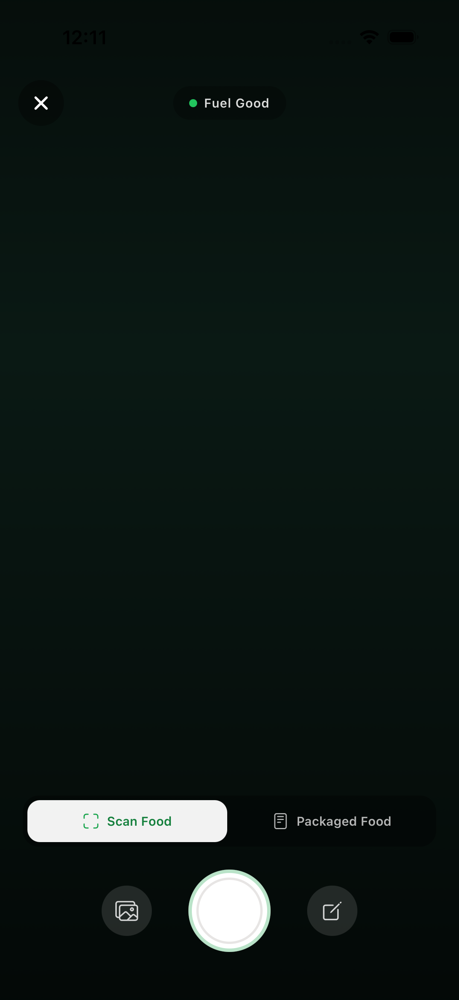

**Grade**: Insufficient (camera permission unavailable on simulator)
**What works**: Two-mode toggle at bottom ("Scan Food / Packaged Food"). White shutter button with subtle green ring. Gallery icon (left) + edit/note icon (right). X close at top-left. "Fuel Good" pill at top-center acts as a consistent brand anchor.
**What's subpar**:
- With no camera feed (simulator) the middle area is just black — need a fallback state ("Camera unavailable — use Photo Library instead") with the gallery icon elevated.
- The shutter button is visually good but doesn't communicate "hold to record / tap to snap" — clarify via a small label.

**Priority**: Revisit on a real device — this screen's visual merit depends entirely on the camera feed.

#### Quick Actions menu (+ button on tab bar)
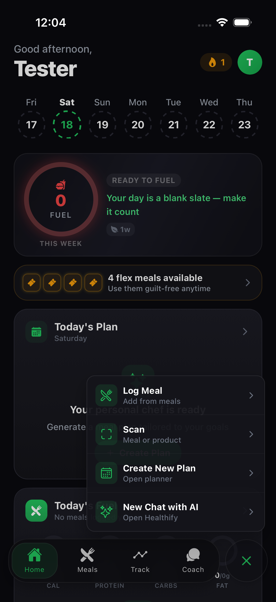 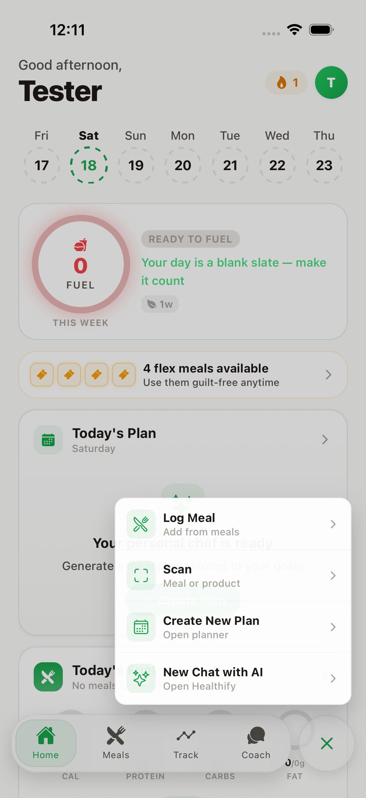

**Grade**: A-
**What works**: Bottom-sheet-style menu with 4 actions (Log Meal / Scan / Create New Plan / New Chat with AI), each with icon + title + subtitle. Nicely compact.
**What's subpar**:
- The menu *overlays* the Home dashboard with a dimmer — dimmer on dark mode is nearly invisible. Increase backdrop darkness.
- The X close button is hard to find — it's at bottom-right where the + was.

**Priority**: Low

---

## Appendix

### Design-token recommendations (additions to `constants/Colors.ts`)

```ts
// Add neutral score state for empty / zero data
ScoreColors: {
  neutral: '#3A3A45',         // dark mode ring when no data yet
  neutralMuted: '#2A2A35',    // track colour behind
  // existing: excellent/strong/decent/mixed/flex
},

// Add macro-specific colours so macro grids don't all read green
MacroColors: {
  protein: '#22C55E',
  carb: '#F59E0B',
  fiber: '#8B5CF6',
  fat: '#F97316',
},

// Add celebration/reward tokens
Reward: {
  earnedGlow: '#FBBF24',         // flex ticket earned
  tier: { elite: '#22C55E', strong: '#16A34A', decent: '#65A30D', mixed: '#EAB308', flex: '#F97316' },
}
```

### Reusable-component suggestions

1. **`<EmptyState />`** — icon + title + subtitle + primary CTA + optional secondary — used at minimum by: Meals Browse (loading fallback), Grocery (no plan), Saved Recipes (empty), Achievements (empty), Track dashboard (no meals).
2. **`<OnboardingHeader />`** — unifies the "5-minute setup" pill + progress bar + optional back arrow into one component.
3. **`<ScoreRing animateOnMount />`** — wrap the current ring with `react-native-reanimated` to animate value in from 0 on every value change. Use everywhere the ring appears.
4. **`<AppHeader variant="back-pill" | "modal-x" />`** — expand `AppScreenHeader.tsx` to cover the two standard header patterns.
5. **`<MacroStatGrid />`** — 2×2 grid of macro values with individual colour accents (reads `MacroColors`).

### Maestro flow files (for regression)

All flows under `tasks/ui-audit/flows/` — 25+ YAML files that can be re-run post-fixes. Core flows:
- `00-auth.yaml` → login + forgot password screenshots
- `10-flavor.yaml`, `11-diet.yaml`, `12c-body.yaml`, `14-goal.yaml`, `16-commit.yaml` → onboarding progression
- `35-meals-subsections.yaml` → Meals hub sweep
- `36-rest-tabs.yaml` → Track + Coach
- `38-profile.yaml` → Profile + Settings
- `41-scan-v2.yaml` → Scan modal
- `52-light-sweep.yaml`, `53-more-light.yaml` → Light-mode pass

Run them all with `maestro test tasks/ui-audit/flows/` after fixes ship — each `takeScreenshot` produces a named PNG you can diff against this baseline.

### What I couldn't capture (follow-up)

- **Paywall** — test account auto-granted premium; needs a non-premium sandbox user.
- **Generated meal plan state** — plan generation flow got interrupted mid-test; no screenshots of filled Today's Plan, populated plan grid, or cook-modal.
- **Chat history drawer** fully open.
- **Recipe detail page** (Meals → Recipe → detail view, and saved-recipe/[id]).
- **Food detail / Food search** results (`(home)/food-search`, `(home)/food-detail/[id]`).
- **Cook modal** (`app/cook/[id].tsx`) — step-by-step cooking guide.
- **Metabolic coach insights** and **flex-onboarding** (one-time first-tap tutorial).
- **Notification permission / push settings** — didn't navigate there.
- **Error states under load** — server-down, network-offline screens not exercised.

All of these are worth a second pass once (a) a sandbox account is configured to hit the real paywall, and (b) the back-end returns data for recipes so Browse isn't stuck on "Loading".

### Accessibility follow-up (out of scope but noted)

- No VoiceOver pass — chip labels have icon glyphs prepended (`\uf536, Savory`) which may read badly to VoiceOver. Verify `accessibilityLabel` overrides.
- No Dynamic Type test — hardcoded `fontSize` values throughout will likely break at 200% text size.
- Colour contrast: at least 3 places noted where body text falls below WCAG AA (activity level captions, email subtitle, chip unselected state).

---

*Audit authored by Claude (Opus 4.7) on 2026-04-18. Captured via Maestro 2.4.0 against iPhone 17 Pro iOS 26.2 simulator running FuelGood bundle `com.fuelgood.ios`. ~75 screenshots at `tasks/ui-audit/screenshots/{dark,light}/`. Flows under `tasks/ui-audit/flows/` can be re-run to produce diffable baselines after fixes ship.*
